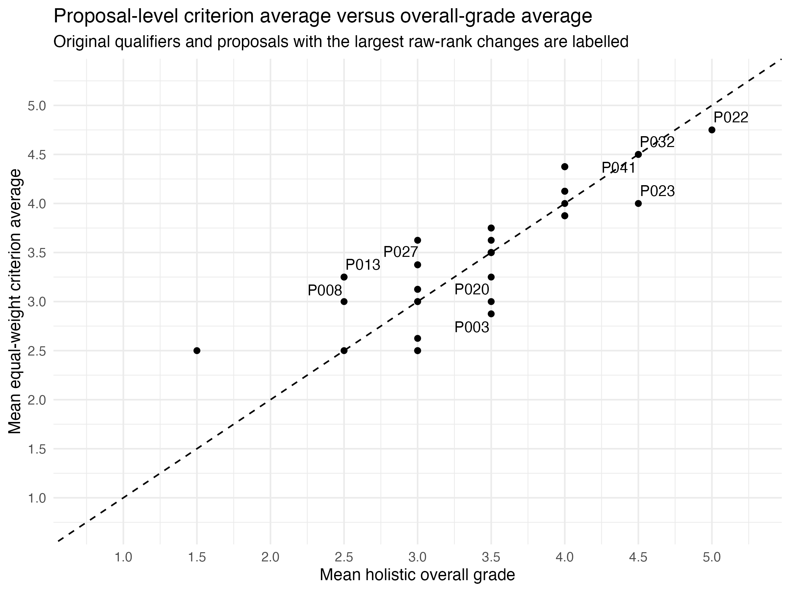
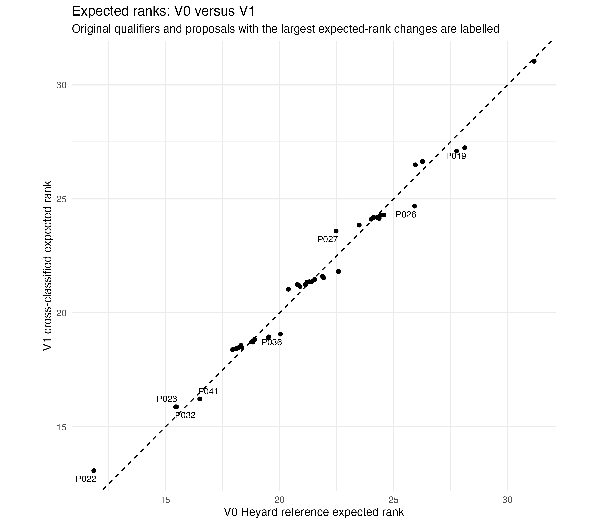
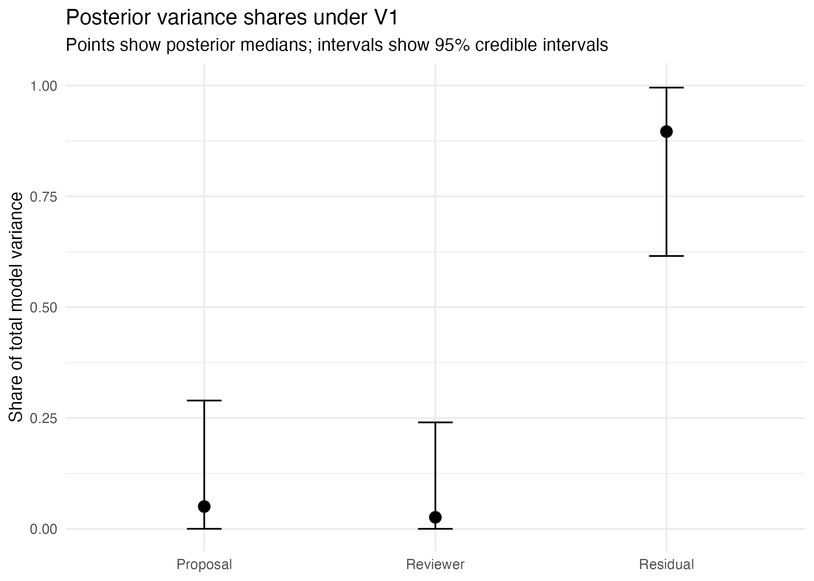
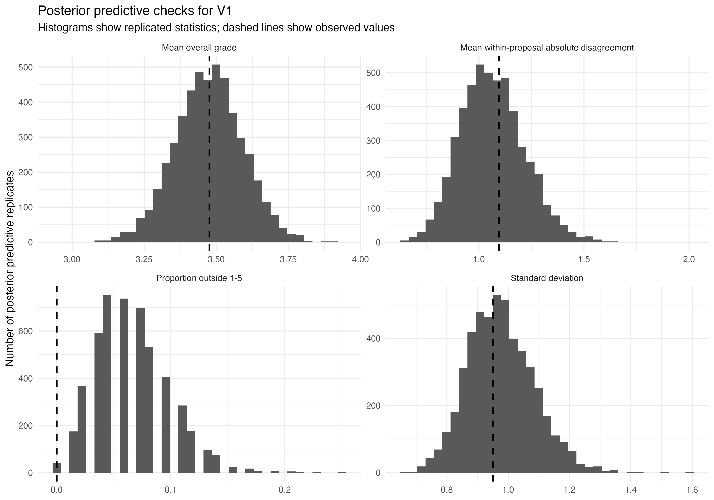
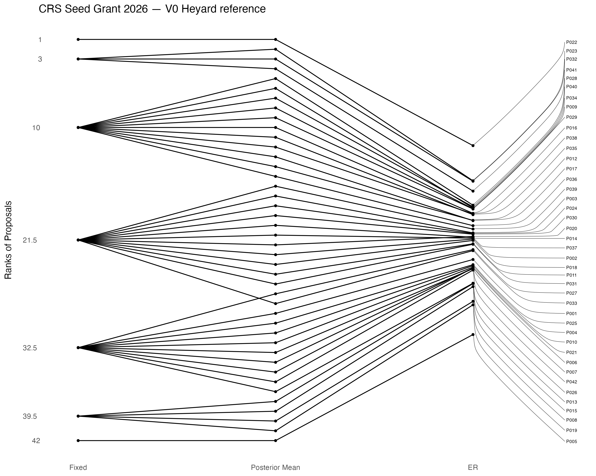
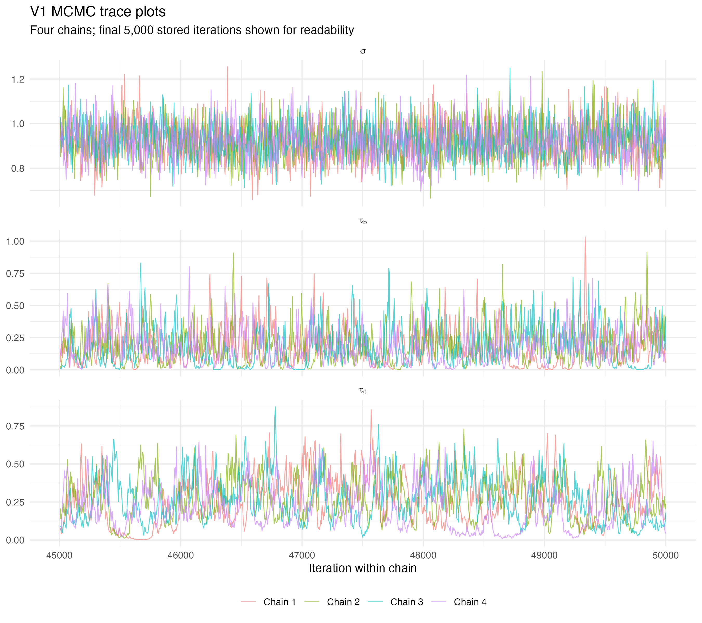
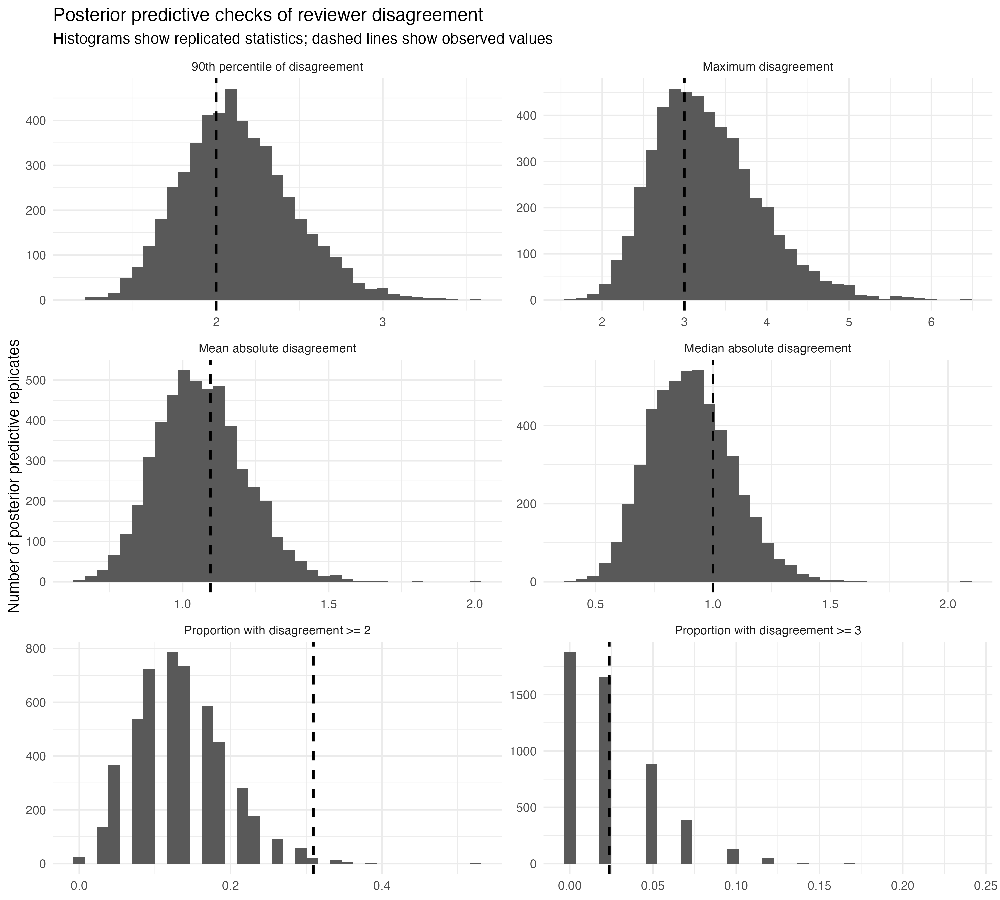
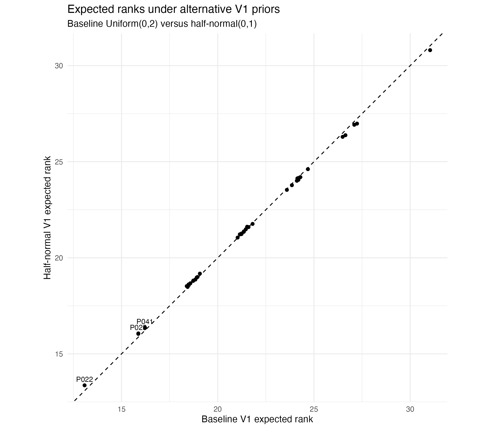

# Abstract {.unnumbered}

Grant funding decisions are often based on only a small number of expert
reviews, making the uncertainty of proposal rankings difficult to assess. This
report studies the 2026 CRS Seed Grant evaluation, in which 42 proposals each
received two reviews from a panel of nine reviewers. Bayesian hierarchical
modelling is used to separate proposal effects, reviewer-associated scoring
tendencies and residual review-level variation, and to quantify uncertainty in
the resulting ranking.

The main model identified the same four proposals as strongest by posterior
mean as the four proposals that qualified under the final CRS decision rule.
However, substantial uncertainty remained about the exact ordering of
individual proposals. The main conclusions were computationally stable and
robust to the tested prior specification, while the continuous Gaussian
treatment of the five-point scores remained an explicit modelling limitation.

Changing the evaluation outcome from the holistic overall grade to an
equal-weight average of the four supporting criteria produced a noticeably
different proposal ordering. Finally, the reviewer--proposal assignment
structure was used to study additional reviews. For small review budgets,
random, disagreement-targeted and model-based sequential allocation produced
almost identical reductions in global proposal-comparison uncertainty.

Overall, Bayesian ranking complements transparent decision rules by making
ranking uncertainty explicit and by clarifying when additional review effort is
likely to be informative.

# Introduction

## Grant evaluation under limited information

Grant peer review converts a limited number of expert judgments into decisions
that can have substantial consequences for applicants. The challenge is not
only disagreement between reviewers, but also the risk of overinterpreting
small score differences when each proposal is assessed by only a few reviewers
and when reviewers may differ systematically in how they use the scoring
scale. Kaplan et al. show directly that finer scoring precision requires
increasingly many independent reviewers, and illustrate how rankings can vary
strongly when only a small number of evaluations are available
[@kaplan2008].

This uncertainty becomes particularly important when proposals are close in score or close to a decision boundary, such as a funding line. In a retrospective analysis of Australian grant panels, Graves et al. found substantial instability in funding status after accounting for variability among panel members' scores [@graves2011]. Jayasinghe, Marsh and Bond reported low single-rater reliability in Australian Research Council grant assessments and used a multilevel cross-classified model to separate proposal- and assessor-related sources of variation [@jayasinghe2003]. Heyard et al. similarly motivate Bayesian ranking by low inter-rater reliability and by the difficulty of distinguishing proposals of similar quality near a funding line [@heyard2022]. These findings do not imply that peer review is uninformative; rather, they motivate distinguishing an observed numerical ordering from the strength of evidence supporting that ordering.

The present project examines this
distinction in a small grant-evaluation setting and subsequently considers whether
the structure of the review design itself can be used to improve the allocation of
limited review effort.

## CRS Seed Grant evaluation 2026

The Center for Reproducible Science and Research Synthesis (CRS) at the
University of Zurich (UZH) works to advance scientific methods and practices
that support trustworthy and reproducible research. Its activities include
research on reproducibility, research synthesis, and meta-research
[@crs2026call].

In 2026, the CRS launched its first Seed Grant call to support early-stage
projects and initiatives in research synthesis, meta-research, and related
fields [@crs2026call]. The evaluation round included 42 proposals
assessed by a panel of nine reviewers. Each proposal received exactly two
independent reviews, resulting in 84 completed review records.

Reviewers evaluated each proposal on four supporting criteria: scientific
quality; potential for scaling and obtaining substantial third-party funding;
relevance to fostering a sustainable, innovative, and diverse Swiss “research
on research” community; and commitment to good research practices, open
science, and reproducibility. Both the four criterion scores and the separate
holistic overall grade were recorded on an integer scale from 1 to 5, with
higher values indicating a more favourable evaluation. Reviewers were not
given a fixed weighting rule for translating the four criterion scores into the
holistic grade; the overall judgment was assigned separately.

The original call described selection using the average score across the four
criteria and reviewers [@crs2026call]. During the development of the evaluation
procedure, this was subsequently replaced by the holistic overall grade, which
became the score used for qualification. The reason for this change was not
documented in the material available for this project.

The call indicated that approximately six projects could be funded [@crs2026call]. In the final evaluation procedure, four proposals met the qualification rule and were selected for funding, as documented on the published results page [@crs2026results]. The rule is reconstructed explicitly in Section 2.2.

## Motivation for Bayesian ranking

The final CRS qualification procedure was transparent and easy to apply, but it
did not quantify how strongly the available reviews separated the underlying
qualities of different proposals. Observed grades may also reflect both proposal
quality and systematic differences in reviewer scoring behaviour.

Bayesian hierarchical modelling provides a way to represent these sources of
variation separately. Heyard et al. model latent proposal effects together with
assessor-related effects and rank proposals using the posterior distribution of
the proposal effects rather than the raw score averages alone [@heyard2022].
Their expected-rank approach retains uncertainty about the relative ordering
instead of treating an estimated ranking as known with certainty.

For the CRS data, Bayesian ranking is therefore used to quantify uncertainty
and support interpretation of the evaluation rather than as a replacement rule
that mechanically determines funding.

## Research questions

### Research Question 1

What ranking does the Bayesian model produce after accounting for reviewer differences, and how uncertain are the resulting ranks?

### Research Question 2

How does the main Bayesian ranking model compare with the final CRS qualification rule and the ranking based on the observed overall grades?

### Research Question 3

Is the main Bayesian model computationally stable, adequate under posterior
predictive checks, and robust to the tested prior specification?

### Research Question 4

How closely do the four supporting criterion scores correspond to the holistic overall grade, and would an equal-weight average of the criteria have produced a materially different proposal ordering?

### Research Question 5

Which single additional reviewer–proposal assignment would most reduce uncertainty under the fitted Bayesian model, and how does this depend on the chosen notion of uncertainty?

## Scope and structure of the report

The holistic overall grade is the main outcome for the Bayesian analysis. The
four supporting criteria are examined separately, including an equal-weight
criterion average used as a descriptive sensitivity analysis rather than as a
preferred scoring rule. V0 reproduces the continuous reference specification
used by Heyard et al. [@heyard2022], while the simpler cross-classified V1
model is used as the main CRS model. After comparing the resulting rankings,
Chapter 5 evaluates the computational stability, posterior predictive behaviour
and prior sensitivity of V1.

Chapter 6 then treats the reviewer--proposal assignment structure as a
statistical-design problem. It first asks which one currently unobserved
assignment would reduce posterior uncertainty most under V1 and compares A-,
D- and E-optimality criteria. It then extends the primary A-optimality criterion
to a practical comparison of small additional-review budgets under random,
disagreement-targeted and sequential A-optimal allocation. Because reviewer
expertise, conflicts and eligibility are not available, these analyses are
interpreted as statistical design comparisons rather than operational assignment
recommendations. The final discussion brings together the ranking, validation,
criterion and review-design results and derives practical implications for future
CRS evaluations.

# Evaluation design and descriptive analysis

## Evaluation process and analytical data

The pseudonymized analytical dataset contains 84 completed reviews of 42 proposals by nine reviewers. Each proposal received exactly two independent reviews. Reviewers completed between 6 and 12 reviews, with assignments based on expertise and availability.

Each review contains four supporting criterion scores and a separate holistic
overall grade. All scores use an integer scale from 1 to 5, where higher values
indicate a more favourable evaluation. Reviewers were free to determine how
the supporting criteria contributed to their separately assigned holistic
grade; no fixed weighting formula was imposed. The Bayesian models use the
holistic overall grade as their outcome. The four criterion scores are retained
for a separate descriptive analysis of their relationship with the overall
grade.

## Reconstruction of the final qualification procedure

According to the published CRS Seed Grant results [@crs2026results], funding was available for proposals that received the highest overall grade from at least one reviewer and no grade below the second-highest category. Since the overall grade was scored on a scale from 1 to 5, this means that a proposal qualified if it received at least one grade of 5 and its second grade was at least 4. With exactly two reviews per proposal, the qualifying score combinations were therefore (5,5), (5,4), and (4,5). Equivalently, a proposal qualified if its mean overall grade was at least 4.5.

This procedure should be interpreted as a score-based qualification threshold rather than as a fixed top-four selection rule. Four proposals satisfied the threshold in the 2026 evaluation round. Since the call indicated that approximately six projects could be funded, the available funding capacity was not binding and no additional prioritization among qualified proposals was required.

## Criteria and holistic overall grade

Previous NIH analyses have examined how criterion scores relate to holistic
overall evaluations [@eblen2016; @erosheva2020]. Eblen et al. found substantial
differences between criteria in their association with the Overall Impact score
[@eblen2016]. This motivates examining whether the four supporting CRS criteria
correspond equally closely to the separately assigned holistic overall grade.

Let $C_{rc}$ denote the score assigned in review $r$ to criterion $c$, and let $Y_r$ denote the holistic overall grade. Their relationship was summarized descriptively using Pearson correlation for linear association and Spearman correlation for monotonic association based on ranks. The corresponding sample definitions are given in @sec-app-correlation. These correlations are treated descriptively because the 84 reviews are not independent with respect to proposals and reviewers.

| Criterion | Mean criterion score | Pearson correlation with overall grade | Spearman correlation with overall grade |
|---|---:|---:|---:|
| Scientific quality | 3.643 | 0.892 | 0.890 |
| Community building | 3.179 | 0.545 | 0.551 |
| Scaling potential | 3.512 | 0.541 | 0.553 |
| Scientific rigor | 3.881 | 0.588 | 0.599 |

: Review-level criterion means and their descriptive correlations with the holistic overall grade. {#tbl-criterion-correlations}

Scientific quality showed the strongest relationship with the holistic overall
grade, with Pearson and Spearman correlations of 0.892 and 0.890. The remaining
three criteria were positively related to the overall grade but less strongly,
with correlations around 0.54--0.60. These correlations do not, however,
identify the weights reviewers placed on the individual criteria.

For a simple equal-weight summary, define the criterion average for review $r$ as

$$
A_r
=
\frac{1}{4}\sum_{c=1}^{4}C_{rc}.
$$

Across the 84 reviews, the mean holistic overall grade was 3.476 and the mean
equal-weight criterion average was 3.554. The Pearson correlation between
$A_r$ and $Y_r$ was 0.859 and the Spearman correlation was 0.849. The mean
difference $A_r-Y_r$ was 0.077 grade points, indicating little systematic
difference in level between the two summaries, and 78.6% of reviews had a
criterion average within 0.5 grade points of the holistic overall grade.

## Equal-weight criterion summary at proposal level

The equal-weight summary is used as a descriptive counterfactual rather than as an estimate of how reviewers actually combined the four criteria. For proposal $i$, let

$$
O_i
=
\frac{1}{2}\sum_{r:p(r)=i}Y_r
$$

denote its mean holistic overall grade, and let

$$
A_i
=
\frac{1}{2}\sum_{r:p(r)=i}A_r
=
\frac{1}{8}\sum_{r:p(r)=i}\sum_{c=1}^{4}C_{rc}
$$

denote the equal-weight average of all eight criterion scores received across its two reviews.

The two proposal-level summaries remained strongly related, with Pearson correlation 0.848 and Spearman correlation 0.881. Their relationship is shown in @fig-proposal-criterion-overall.

{#fig-proposal-criterion-overall width=85% fig-pos="H"}

The holistic proposal average is relatively coarse because it is calculated from only two integer-valued grades, whereas $A_i$ averages eight criterion scores and therefore has finer numerical resolution. Raw-rank changes are consequently sensitive to the breaking of ties and are not emphasized here.

At the top of the distribution, P022 had criterion average 4.75 and P032 and P041 had 4.50. These are three of the four proposals that qualified under the final CRS rule. The fourth qualifier, P023, had criterion average 4.00, while several non-qualified proposals had criterion averages of 4.375. Thus, equal weighting preserves substantial agreement with the holistic evaluation but does not reproduce its upper ordering exactly.

# Bayesian ranking framework

## Related work

The Bayesian ranking framework used in this project follows directly from
Heyard et al. [-@heyard2022], who developed a Bayesian hierarchical model for
the evaluation of research proposals at the Swiss National Science Foundation.
In their formulation, each proposal $i$ has a latent proposal effect
$\theta_i$, representing its underlying position on the modelled evaluation
scale. Rather than ranking proposals only by observed scores or by point
estimates of these effects, the posterior distribution of the proposal effects
is used to quantify uncertainty in their relative ordering.

Heyard et al. place this approach within an earlier literature on Bayesian
ranking. In particular, they draw on Laird and Louis [-@laird1989], who
developed Bayes and empirical-Bayes methods for estimating the ranks of random
effects in variance-component models. Heyard et al. summarize the posterior
rank distribution of proposal $i$ through its expected rank,

$$
\operatorname{E}[\operatorname{rank}(\theta_i)\mid Y],
$$

which is also the principal Bayesian ranking quantity used in this report.

Bayesian hierarchical modelling has also previously been applied directly to
grant-review ratings. Johnson [-@johnson2008] analysed NIH peer-review ratings
using a Bayesian hierarchical model that allows for differences in reviewer
scoring patterns and quantifies posterior uncertainty in proposal ratings.
For ordinal grant scores, Heyard et al. additionally draw on Johnson
[-@johnson2008] and Cao, Stokes and Zhang [-@cao2010] to formulate an
alternative model based on an underlying continuous proposal-quality trait
that is translated into observed ordinal categories. Cao et al. develop such
a Bayesian hierarchical multirater model explicitly for ranking, allowing
both a latent item trait and rater-specific characteristics, and demonstrate
the approach using grant-review data.

The proposal--reviewer structure is also related to the cross-classified
grant-review model of Jayasinghe, Marsh and Bond [-@jayasinghe2003]. When
reviewers assess multiple proposals and proposals receive evaluations from
multiple reviewers, proposal and reviewer effects are crossed rather than
nested. This provides the structural motivation for retaining persistent
proposal and reviewer effects in the simpler V1 specification used here.

More recently, Heyard et al. [-@heyard2025] applied Bayesian ranking to
individual evaluations of 1,006 Marie Skłodowska-Curie Actions proposals and
compared the resulting model-based rankings with scores, rankings and funding
decisions established after consensus meetings. Their analysis again used
expected ranks of latent proposal effects while adapting the hierarchical
model to the information available on individual experts.

The present analysis therefore does not introduce a new Bayesian ranking
method. It takes the framework of Heyard et al. as its methodological starting
point, reproduces their continuous reference specification as V0, and examines
whether a simpler crossed proposal--reviewer specification preserves the
substantive ranking conclusions in the CRS setting.

## V0: Heyard reference model

The reference model V0 reproduces the continuous homogeneous-variance
specification of Heyard et al. [-@heyard2022]. Let $r=1,\ldots,84$ index
completed reviews, let $p(r)$ denote the proposal evaluated in review $r$, and
let $a(r)$ denote the reviewer who produced that review. The observed holistic
overall grade is $Y_r$, and $\bar Y$ denotes its sample mean over all 84
reviews.

The model is

$$
Y_r \mid \theta,\lambda
\sim
\mathcal{N}\!\left(
\bar Y+\theta_{p(r)}+\lambda_{p(r),a(r)},
\sigma^2
\right),
$$

with proposal effects

$$
\theta_i\sim\mathcal{N}(0,\tau_\theta^2),
$$

and proposal--reviewer assessment effects

$$
\lambda_{ij}\sim\mathcal{N}(\nu_j,\tau_\lambda^2),
\qquad
\nu_j\sim\mathcal{N}(0,0.5^2).
$$

For proposal $i$, the latent proposal effect $\theta_i$ is the quantity used for
ranking. For reviewer $j$, $\nu_j$ represents a persistent reviewer-specific
scoring tendency. The assessment effect $\lambda_{ij}$ for proposal $i$ and
reviewer $j$ is centred on $\nu_j$, so that
$\lambda_{ij}-\nu_j$ represents an additional deviation specific to that
proposal--reviewer assessment.

V0 is retained as the methodological reference model rather than as the
preferred CRS specification. Each reviewer--proposal pair is observed only once
in the CRS data. The pair-specific deviation $\lambda_{ij}-\nu_j$ is therefore
informed by only one score and is difficult to distinguish from residual
review-level variation. This motivates the simpler V1 model, which retains
persistent proposal and reviewer effects but removes the additional
pair-specific layer.

## V1: CRS cross-classified model

The CRS-specific model V1 simplifies V0 by removing the
proposal--reviewer-specific assessment effect and serves as the main model for
the CRS analysis. Each observed grade is
decomposed into three sources of variation: a proposal effect, a reviewer effect
and residual review-level variation.

Let $p(r)$ denote the proposal evaluated in review $r$, and let $a(r)$ denote
the reviewer who produced that review. V1 assumes

$$
Y_r
=
\bar Y
+
\theta_{p(r)}
+
b_{a(r)}
+
\varepsilon_r,
\qquad
\varepsilon_r\sim\mathcal{N}(0,\sigma^2),
$$

or equivalently,

$$
Y_r
\sim
\mathcal{N}\!\left(
\bar Y+\theta_{p(r)}+b_{a(r)},
\sigma^2
\right).
$$

Here, $\bar Y$ is the observed mean overall grade. The proposal effect
$\theta_i$ represents how proposal $i$ tends to score relative to this overall
mean, while the reviewer effect $b_j$ represents how reviewer $j$ tends to score
relative to other reviewers. The remaining term $\varepsilon_r$ captures
review-level variation that is not explained by either effect.

The proposal and reviewer effects are assigned hierarchical distributions,

$$
\theta_i\sim\mathcal{N}(0,\tau_\theta^2),
\qquad
b_j\sim\mathcal{N}(0,\tau_b^2).
$$

The latent proposal effects $\theta_i$ are the quantities used for ranking.
Because reviewer assignments were based on expertise and availability rather
than random allocation, the estimated reviewer effects are interpreted
descriptively as reviewer-associated scoring tendencies rather than as causal
measures of reviewer bias.

The model is cross-classified because every observed grade belongs simultaneously
to a proposal and a reviewer, while neither grouping is nested within the other,
meaning that reviewers are not restricted to a single proposal and proposals are
not restricted to a single reviewer.

The hierarchical specification also induces partial pooling. Proposal effects
with limited information are pulled toward zero, corresponding to the overall
mean grade $\bar Y$ on the observed scale, with the amount of pooling governed
by the estimated between-proposal variation $\tau_\theta^2$. Reviewer effects
are pooled analogously through $\tau_b^2$. This regularization is particularly
relevant in the CRS setting because each proposal contributes only two observed
grades.

Estimation follows from Bayesian updating: the likelihood contributed by the
observed grades is combined with the hierarchical prior distributions to obtain
the joint posterior distribution of the proposal and reviewer effects and the
variance parameters. A short mathematical derivation of this updating and the
resulting partial pooling is given in @sec-app-bayesian-updating.

## Assumptions and prior specification

Both V0 and V1 treat the observed grades as conditionally Gaussian with a
common residual variance and assume exchangeable proposal effects around
zero. V1 additionally treats the reviewer effects as exchangeable around
zero. The overall mean $\bar Y$ is fixed at the observed mean grade rather
than estimated as a separate intercept.

For V0, the scale parameters use

$$
\sigma,\tau_\theta,\tau_\lambda
\sim
\operatorname{Uniform}(0,2),
$$

while V1 uses

$$
\sigma,\tau_\theta,\tau_b
\sim
\operatorname{Uniform}(0,2).
$$

The lower endpoint is implemented numerically as $10^{-6}$. The sensitivity
of the main V1 conclusions to this scale-prior specification is examined in
Chapter 5.

Although the holistic overall grade is recorded on an integer scale from
1 to 5, both models use the continuous Gaussian formulation of Heyard et al.
[-@heyard2022]. This treats adjacent categories as equally spaced. Since the
main target is the relative ranking of latent proposal effects rather than
prediction of valid score categories, this approximation is retained here;
its limitations are assessed through posterior predictive checks in Chapter 5.

## Posterior ranking quantities

The ranking is based on the posterior distribution of the proposal effects
$\theta_1,\ldots,\theta_{42}$ rather than directly on the observed score
averages. For posterior draw $s$, the rank of proposal $i$ is

$$
R_i^{(s)}
=
1+\sum_{k\neq i}
\mathbb{1}_{\{\theta_k^{(s)}>\theta_i^{(s)}\}},
$$

where rank 1 corresponds to the proposal with the largest latent proposal
effect and $\mathbb{1}_{\{\cdot\}}$ denotes the indicator function.

The posterior mean of this rank distribution is the expected rank,

$$
ER_i
=
\operatorname{E}[R_i\mid Y].
$$

Using the definition of $R_i$,

$$
ER_i
=
1+\sum_{k\neq i}
\mathbb{P}(\theta_k>\theta_i\mid Y).
$$

Expected rank can therefore be interpreted as 1 plus the sum of the
posterior probabilities that each competing proposal has a larger latent
effect than proposal $i$. In practice, it is estimated from the posterior
draws by

$$
ER_i
\approx
\frac{1}{S}\sum_{s=1}^{S}R_i^{(s)}.
$$

Expected rank is the principal Bayesian ranking quantity used in this
report and follows Heyard et al. [-@heyard2022]. With 42 proposals, the midpoint of the rank scale is

$$
\frac{42+1}{2}=21.5.
$$

When many of the pairwise ordering probabilities for proposal $i$ are close
to 0.5 ($\mathbb{P}(\theta_k>\theta_i\mid Y) \approx 0.5$), its expected rank is consequently pulled toward the centre of the
rank scale.

Three ranking summaries are distinguished throughout the analysis. The
**raw-score rank** orders proposals by their mean observed overall grade,
the **posterior-mean rank** orders the posterior means of $\theta_i$, and
the **expected rank** averages the proposal's rank across the full posterior
distribution. Rank uncertainty is summarized by the 90% posterior rank
interval, defined by the 5th and 95th percentiles of $R_i$.

For comparisons between particular proposals, pairwise posterior
probabilities such as

$$
\mathbb{P}(\theta_i>\theta_k\mid Y)
$$

give a more direct measure of the evidence for one proposal being ranked
above another. These are particularly useful when small changes in a model
produce different integer ranks for proposals that are nearly tied.

## Posterior computation and diagnostics

All Bayesian models were fitted in JAGS from R. V0 uses the explicit
Heyard reference specification implemented through `ERforResearch`, while
V1 uses a custom JAGS model with one persistent reviewer effect per
reviewer.

Unless stated otherwise, each final fit used four Markov chains, 10,000
adaptation iterations, 10,000 burn-in iterations and 50,000 retained
sampling iterations per chain, giving 200,000 posterior draws in total.
All MCMC fits used a fixed random seed of 20260727 to ensure reproducibility.

Posterior-mean ranks, expected ranks, rank intervals and pairwise posterior
probabilities were calculated from the retained posterior draws. Numerical
convergence was assessed using the potential scale reduction factor (PSRF)
and effective sample size (ESS). These diagnostics assess whether the
posterior computation is stable; statistical model adequacy is evaluated
separately through posterior predictive checks and sensitivity analysis in
Chapter 5.

# Bayesian ranking results

## Main V1 ranking and comparison with the final CRS procedure

The CRS-specific V1 model preserves the broad upper ordering based on the
observed overall grades while showing that the exact latent ranks are highly
uncertain. P022 had posterior-mean rank 1 and expected rank 13.08. P032, P023 and P041 occupied posterior-mean ranks 2, 3 and 4, with expected ranks 15.87, 15.87 and 16.22, respectively. These are exactly the four proposals that satisfied the final CRS qualification threshold.

Because each proposal mean is based on only two integer-valued grades, the
observed-score ranking contains many ties. The 42 proposals take only seven
distinct mean-score values, so several proposals share the same observed rank
before any model-based adjustment is applied.

The posterior-mean ordering is therefore much sharper than the posterior
evidence supporting the exact relative positions. The 90% posterior rank interval for P022 was 1--36; for P023 and P032 it was 1--37; and for P041 it was 1--38. The relationship between the observed-score rank, posterior-mean rank and posterior expected rank is shown in @fig-v1-ranking-comparison.

This distinction is the main additional information provided by the Bayesian ranking relative to the final qualification rule. The CRS procedure identifies proposals that satisfy a transparent score threshold; it does not quantify how strongly the available reviews separate their latent proposal effects. In the present data, the same four proposals appear strongest under both approaches, but their exact positions are weakly identified. The Bayesian analysis is therefore interpreted as uncertainty-aware decision support rather than as a retrospective replacement for the CRS rule.

{#fig-v1-ranking-comparison width=95% fig-pos="H"}

## Robustness of the Ranking to the Heyard Reference Specification

The V0 Heyard reference model gives almost the same substantive result. The
four CRS qualifiers again occupy the first four posterior-mean positions. More
generally, the rankings under V0 and V1 show very strong agreement. This is
quantified by a Spearman correlation of 0.9951 between posterior-mean ranks and
a Pearson correlation of 0.9916 between expected ranks across the 42 proposals.
The close agreement is visible in @fig-expected-rank-v0-v1.

{#fig-expected-rank-v0-v1 width=85% fig-pos="H"}

Small changes in integer ranks can nevertheless occur when proposals are almost indistinguishable. Twenty-six of the 42 proposals changed posterior-mean integer rank, but these changes were small: the mean absolute change was 0.86 positions and the maximum was three positions. P023 and P032 provide a clear example: V0 places P023 above P032, while V1 reverses them. Yet

$$
\mathbb{P}(\theta_{032}>\theta_{023}\mid Y)=0.498955
$$

under V0 and

$$
\mathbb{P}(\theta_{032}>\theta_{023}\mid Y)=0.500470
$$

under V1. The apparent reversal is therefore an almost exact posterior tie rather than evidence that the two models disagree meaningfully about these proposals.

Rank uncertainty is equally stable across the two specifications. The mean width of the 90% posterior rank intervals was 36.50 positions under V0 and 36.74 under V1, with median width 37 under both models. Thus, simplifying V0 to the cross-classified V1 model changes little about either the broad ordering or the central finding that exact ranks are poorly identified. Detailed V0 ranking output and computational diagnostics are retained in @sec-app-v0.

## Bayesian ranking using the equal-weight criterion average

The descriptive criterion analysis in Sections 2.3 and 2.4 suggests that the holistic grade and an equal-weight criterion average contain overlapping but not identical information. To examine whether this difference persists after accounting for reviewer-associated scoring tendencies and ranking uncertainty, V1 was fitted a second time using the review-level criterion average $A_r$ as the response:

$$
A_r
\sim
\mathcal{N}\!\left(
\bar{A}
+
\theta^{(A)}_{p(r)}
+
b^{(A)}_{a(r)},
\sigma_A^2
\right),
$$

with

$$
\theta_i^{(A)}\sim\mathcal{N}(0,\tau_{\theta,A}^2),
\qquad
b_j^{(A)}\sim\mathcal{N}(0,\tau_{b,A}^2).
$$

The reviewer--proposal assignments, priors and MCMC settings were kept identical to the overall-grade V1 fit; only the response and its observed mean changed. The resulting fit had satisfactory computational diagnostics (maximum PSRF 1.0032; minimum ESS 1,863).

Changing the response had a noticeably larger effect than changing from V0 to V1. The Spearman correlation between posterior-mean ranks from the two V1 fits was 0.873, and the Pearson correlation between expected ranks was 0.863. The mean absolute expected-rank change was 2.97 positions and the maximum was 7.89. By comparison, the Pearson correlation between V0 and V1 expected ranks using the same holistic outcome was 0.9916.

The comparison of expected ranks is shown in @fig-er-overall-criterion.

{#fig-er-overall-criterion width=82% fig-pos="H"}

The upper ordering illustrates the difference. P022 and P032 remained at posterior-mean ranks 1 and 2 under the criterion-average model, P041 moved from rank 4 to rank 3, and P040 moved from rank 6 to rank 4. P023 moved from posterior-mean rank 3 to rank 11. That last change is less dramatic when uncertainty is considered: its expected rank changed only from 15.87 to 16.80, whereas P040 improved from 18.43 to 12.19. Expected-rank changes therefore provide a more informative comparison than exact integer ranks alone.

The criterion-average fit also produced somewhat narrower posterior rank
distributions. The mean width of the 90% posterior rank intervals decreased
from 36.74 to 33.19 positions, while the median width decreased from 37 to 34.
The observed criterion average also had lower dispersion than the holistic grade, with standard deviations of 0.772 and 0.950, respectively. Since the criterion average combines four scores, part
of this reduction in variation can arise mechanically from averaging.
The corresponding change in the fitted variance decomposition is examined
in @sec-variance-diagnostics.

The comparison does not establish that one score summary is preferable to the
other. It shows that the definition of the evaluation outcome matters
materially for the posterior ordering: changing from the holistic overall
grade to the equal-weight criterion average has a larger effect than changing
from V0 to V1 while holding the holistic outcome fixed.

# Validation and sensitivity analysis of V1

## Validation strategy

Unless stated otherwise, the validation in this chapter refers to V1 fitted to
the holistic overall grade, which is the main working model. The close agreement
between V0 and V1 shows that the main ranking conclusion is not sensitive to
the additional assessment-specific layer in V0, but it does not establish that
V1 adequately represents important features of the observed reviews.

Validation therefore focuses on three questions: whether the posterior
computation is stable, whether V1 reproduces important features of the observed
grades, and whether the main conclusions depend materially on the baseline
scale priors.

## Computational and variance diagnostics {#sec-variance-diagnostics}

The V1 posterior was sampled reliably. Across all monitored parameters, the
maximum PSRF was 1.0017 and the minimum effective sample size was 1,627.
The corresponding trace plots are provided in @sec-app-trace.

To examine how V1 distributes variation across proposals, reviewers and
individual reviews, note that its marginal variance is

$$
\operatorname{Var}(Y_r)
=
\tau_\theta^2+\tau_b^2+\sigma^2.
$$

For posterior draw $s$, define

$$
V^{(s)}
=
\left(\tau_\theta^{(s)}\right)^2
+
\left(\tau_b^{(s)}\right)^2
+
\left(\sigma^{(s)}\right)^2.
$$

The corresponding variance shares are

$$
\rho_{\mathrm{proposal}}^{(s)}
=
\frac{\left(\tau_\theta^{(s)}\right)^2}{V^{(s)}},
\qquad
\rho_{\mathrm{reviewer}}^{(s)}
=
\frac{\left(\tau_b^{(s)}\right)^2}{V^{(s)}},
\qquad
\rho_{\mathrm{residual}}^{(s)}
=
\frac{\left(\sigma^{(s)}\right)^2}{V^{(s)}}.
$$

For the overall-grade V1 model, the posterior medians of these shares were
0.050, 0.026 and 0.896, respectively. The corresponding 95% credible
intervals were approximately $[0.0002,0.289]$, $[0.0001,0.240]$ and
$[0.615,0.995]$.

{#fig-v1-variance-shares width=72% fig-pos="H"}

The proposal variance share also has a reliability interpretation. Consider two
ratings of the same proposal $i$ made by different reviewers $j$ and $k$.
Under V1,

$$
Y_{ij}
=
\bar Y+\theta_i+b_j+\varepsilon_{ij},
\qquad
Y_{ik}
=
\bar Y+\theta_i+b_k+\varepsilon_{ik}.
$$

The two ratings share the same proposal effect $\theta_i$, whereas their
reviewer effects and residual errors are distinct. Under the model assumptions
that proposal effects, reviewer effects and residual errors are mutually
independent, and that $b_j$ and $b_k$ are independent for $j\neq k$,

$$
\operatorname{Cov}(Y_{ij},Y_{ik})
=
\operatorname{Var}(\theta_i)
=
\tau_\theta^2.
$$

Marginally, each rating has variance

$$
\operatorname{Var}(Y_{ij})
=
\operatorname{Var}(Y_{ik})
=
\tau_\theta^2+\tau_b^2+\sigma^2.
$$

It follows that

$$
\operatorname{Cor}(Y_{ij},Y_{ik})
=
\frac{\tau_\theta^2}
{\tau_\theta^2+\tau_b^2+\sigma^2}
=
\rho_{\mathrm{proposal}}.
$$

Thus, under V1, the proposal variance share is also the model-implied
intraproposal correlation: the expected correlation between two ratings of the
same proposal by different reviewers. This corresponds to the cross-classified
reliability interpretation used by Jayasinghe et al. [-@jayasinghe2003].

The posterior median of approximately 0.05 therefore indicates weak
model-implied agreement attributable to a shared proposal effect. Most of the
variation in individual grades is instead attributed to reviewer-specific and,
predominantly, residual review-level variation. This helps explain why the
posterior ranking remains broad despite observing two ratings per proposal,
although the variance decomposition alone does not establish that the sparse
assignment design is the cause of this uncertainty.

For comparison, the same variance decomposition was calculated for the V1
fit using the equal-weight criterion average $A_r$ as the response.

| Response | Proposal share | Reviewer share | Residual share |
|---|---:|---:|---:|
| Holistic overall grade | 0.050 | 0.026 | 0.896 |
| Equal-weight criterion average | 0.192 | 0.046 | 0.733 |

: Posterior median variance shares under V1 for the holistic overall grade and the equal-weight criterion-average outcomes. {#tbl-variance-shares}

For every posterior draw, the three variance shares sum to one. The values
reported in the table are the medians of the three posterior distributions
calculated separately, so their reported medians need not sum exactly to one.

The criterion-average model attributes a larger share of its fitted variation
to differences between proposals and a smaller share to residual review-level
variation than the holistic-grade model. However, the two decompositions
concern different response variables: $A_r$ averages four criterion scores and
has lower observed dispersion than the holistic grade. The larger proposal
share should therefore not be interpreted as evidence that the equal-weight
criterion average is intrinsically a better evaluation measure.

## Posterior predictive assessment

Posterior predictive checks used 5,000 replicated datasets to assess whether V1
reproduces the observed location, dispersion and reviewer disagreement. For
posterior draw $s$ and review $r$, let
$Y_r^{\mathrm{rep},(s)}$ denote the corresponding **replicated** grade. It was
generated as

$$
Y_r^{\mathrm{rep},(s)}
\sim
\mathcal{N}\!\left(
\bar{Y}
+
\theta_{p(r)}^{(s)}
+
b_{a(r)}^{(s)},
\left(\sigma^{(s)}\right)^2
\right).
$$

The observed mean absolute disagreement between the two reviews of a proposal
was 1.095, compared with a posterior predictive mean of 1.064. Approximately
40% of replicated datasets produced at least as much mean disagreement as
observed, placing the observed value well within the central part of the
posterior predictive distribution rather than in an extreme tail.

A more detailed check showed that the close correspondence is not mechanically
induced by the shared proposal effect, which cancels when taking the difference
between the two reviews of a proposal. The corresponding analytic expectation
was 1.066, almost identical to the simulated value 1.064, and most of this
disagreement was attributable to residual review-level variation rather than
persistent reviewer effects. Mapping replicated scores to the observed
integer-valued 1--5 grid did not reduce the small difference in mean
disagreement, but it substantially reduced the apparent discrepancy for
disagreements of at least two score points, with the corresponding posterior
predictive probability increasing from 0.0088 to 0.272. Full derivations and
additional disagreement diagnostics are given in @sec-app-disagreement.

The main model-form limitation is visible in the lower-left panel of @fig-v1-ppc. Because the Gaussian likelihood is unbounded, an average of 6.6% of replicated grades fall below 1 or above 5. V1 is therefore retained as a continuous approximation for latent proposal effects and ranking uncertainty, not as a literal generative model for valid future score categories.

{#fig-v1-ppc width=90% fig-pos="H"}

## Prior sensitivity

The baseline scale priors

$$
\sigma,\tau_\theta,\tau_b\sim\operatorname{Uniform}(0,2)
$$

were replaced by independent $\operatorname{HalfNormal}(0,1)$ priors.
This choice follows the suggestion of Heyard et al. [-@heyard2022] that
half-normal priors provide a useful alternative specification for variance
parameters. The $\operatorname{HalfNormal}(0,1)$ distribution provides a
positive, unbounded alternative to the bounded uniform prior: it places more
prior mass near small scale values while still allowing values above 2. This
provides a sensitivity check against a meaningfully different but still
weakly regularizing prior shape.

The likelihood, data and MCMC settings were otherwise kept unchanged. The ranking conclusions were essentially unchanged: the Pearson correlation between expected ranks from the two prior specifications was 0.99994, the mean absolute expected-rank change was 0.093 positions and the maximum was 0.283. The median width of the 90% posterior rank intervals was 37 under both specifications. Posterior median variance shares were also nearly identical: the proposal share changed from 0.050 to 0.046, the reviewer share from 0.026 to 0.025 and the residual share from 0.896 to 0.902. The corresponding expected-rank figure and additional numerical details are provided in @sec-app-prior.

## Validation conclusion

The validation provides no strong indication that the main V1 ranking
conclusions are driven by computational instability, the tested scale priors or
a failure to reproduce the observed mean, dispersion and reviewer-disagreement
structure. The fitted model attributes most variation to residual review-level
variation, while the exact proposal ranks remain weakly identified.

The principal model-form caveat is the continuous Gaussian treatment of the
five-point score, which permits replicated values outside the admissible range.
Subject to this approximation and the non-random reviewer assignment, V1 is
retained as the working model. The substantial remaining uncertainty motivates the next chapter, which
investigates whether the structure of the review design can identify a
statistically informative single additional review.

# Graph-based review design

## Motivation and scope

The Bayesian analysis in the preceding chapters shows that the broad upper
ordering of the CRS proposals is relatively stable, while the exact latent
proposal ranks remain highly uncertain. Each proposal was evaluated by only two
reviewers, and the reviewer--proposal assignments determine which proposal and
reviewer effects are informed jointly by the observed grades.

The allocation of evaluations to reviewers is itself a statistical-design
problem. In research peer review, Cook et al. [-@cook2005] formulate the
allocation of proposals to reviewers with the explicit aim of facilitating an
overall ranking, while Stelmakh, Shah and Singh [-@stelmakh2021] study
reviewer assignment under objectives involving fairness and statistical
accuracy. Related work on statistical ranking goes one step further:
Osting, Brune and Osher [-@osting2014] start from an existing pairwise-comparison
graph and investigate how additional, targeted comparisons can increase the
information available for ranking. In a Bayesian crowdsourcing setting,
Simpson and Roberts [-@simpsonroberts2015] similarly select informative
agent--task assignments according to their expected information gain. These
settings differ from CRS, but together they provide precedents for treating the
allocation of additional evaluations as an information-design problem rather
than as statistically neutral.

The purpose of the present chapter is not to assess whether the original CRS
reviewer assignments were appropriate. Assignments were based on expertise and
availability, and detailed information on reviewer eligibility, expertise and
conflicts of interest is not available for the present analysis. Instead, the
existing assignment structure is represented mathematically and its connection
to posterior uncertainty under V1 is examined.

The analysis first considers a deliberately restricted prospective question:
if exactly one additional review could hypothetically be obtained, which
currently unobserved reviewer--proposal assignment would provide the greatest
reduction in uncertainty under V1? Established optimal-design criteria are used
rather than introducing a new measure of uncertainty, and several criteria are
compared because different notions of statistical precision need not prefer the
same additional review.

After establishing the single-review calculation, the primary A-optimality
criterion is extended to a small multi-review budget. This provides a practical
comparison between random allocation, targeting proposals with high observed
reviewer disagreement, and sequential model-based allocation.

## Reviewer--proposal assignment structure

The CRS assignment structure can be represented as a bipartite graph. A graph
consists of vertices connected by edges, and it is called **bipartite** when
the vertices can be separated into two groups such that every edge joins one
group to the other.

This representation is closely related to the **Levi graph**, or incidence
graph, used in the theory of incomplete block designs [@baileycameron2011].
In a block design, one class of vertices represents treatments and the other
represents blocks, with an edge recording that a treatment occurs in a block.
For the present application, proposals play the role of treatments and
reviewers play the role of blocks: a reviewer is connected to every proposal
that the reviewer evaluated.

Formally, define

$$
G=(P\cup R,E),
$$

where

$$
P=\{P_1,\ldots,P_{42}\}
$$

is the set of proposal vertices,

$$
R=\{R_1,\ldots,R_9\}
$$

is the set of reviewer vertices, and

$$
(P_i,R_j)\in E
$$

whenever reviewer $j$ evaluated proposal $i$.

The observed CRS design therefore has

$$
|P|=42,\qquad |R|=9,\qquad |E|=84.
$$

The **degree** of a vertex is the number of edges incident to it. Every proposal
vertex has degree two because each proposal received exactly two reviews.
Reviewer degrees equal reviewer workloads and range from 6 to 12.

A small subset of the observed assignment graph is shown in
@fig-review-assignment-graph to illustrate the bipartite structure. Reviewer
vertices are placed on the left and proposal vertices on the right; an edge
indicates that the reviewer evaluated the corresponding proposal. The figure is
illustrative only and does not display the complete CRS assignment graph.

{#fig-review-assignment-graph width=82% fig-pos="H"}

The graph records only the assignment structure: an edge states that a review
occurred, not which grade was assigned. It therefore separates the design of
the evaluation from the numerical outcomes subsequently observed.

## Statistical relevance of the assignment structure

The graph representation is statistically relevant because the connection
between incidence graphs and information matrices is well established in
incomplete block-design theory. Bailey and Cameron [-@baileycameron2011]
consider an additive treatment--block model and show that, after changing the
sign of the block parameters, the corresponding information structure can be
represented through the Laplacian of the Levi graph. The CRS model has an
analogous crossed structure, with proposal effects replacing treatment effects
and reviewer effects replacing block effects.

To obtain the standard signed incidence-matrix representation, reparameterize
the reviewer effect as

$$
c_j=-b_j.
$$

The symbol $c_j$ is only a sign-transformed reviewer effect; it does not denote
a graph connection. This reparameterization allows each incidence vector to use
the conventional $+1$ sign for a proposal vertex and $-1$ for a reviewer
vertex.

For an observed grade assigned by reviewer $j$ to proposal $i$, V1 can then be
written as

$$
Y_{ij}-\bar Y
=
\theta_i-c_j+\varepsilon_{ij}.
$$

Collect the proposal and transformed reviewer effects into

$$
\beta
=
(\theta_1,\ldots,\theta_{42},
c_1,\ldots,c_9)^\top.
$$

For each observed reviewer--proposal edge $e=(i,j)$, define an
**oriented incidence vector** $x_e$ containing $+1$ at the position
corresponding to proposal $i$, $-1$ at the position corresponding to reviewer
$j$, and zero elsewhere. Stacking the 84 incidence vectors gives an incidence
matrix $X$, so that

$$
Y-\bar Y\mathbf 1
=
X\beta+\varepsilon
$$
Here, $\mathbf 1\in\mathbb{R}^{84}$ denotes the vector of ones, so that
$\bar Y\mathbf 1$ subtracts the observed mean from each of the 84 grades.

For an oriented incidence matrix,

$$
X^\top X=L_G,
$$

where $L_G$ is the graph Laplacian. Its diagonal entries are the vertex
degrees, while an off-diagonal entry is $-1$ when the corresponding proposal
and reviewer are connected and zero otherwise.

The same matrix enters the conditional posterior information in V1.
Conditional on $\tau_\theta$, $\tau_b$ and $\sigma$, the prior precision for
$\beta$ is

$$
P_0
=
\begin{pmatrix}
\tau_\theta^{-2}I_{42} & 0_{42\times9}\\
0_{9\times42} & \tau_b^{-2}I_9
\end{pmatrix}.
$$

Thus, the proposal and reviewer effects have separate prior precisions and no
prior cross-covariance.

Combining prior and Gaussian likelihood gives conditional posterior precision

$$
Q
=
P_0+\frac{1}{\sigma^2}X^\top X
=
P_0+\frac{1}{\sigma^2}L_G,
$$

and conditional posterior covariance

$$
V=Q^{-1}.
$$

Thus, the assignment graph is not merely a visualization of the review
structure: its Laplacian contributes directly to the conditional posterior
precision of the proposal and reviewer effects. Changing an assignment changes
$L_G$ and hence changes the posterior covariance under the model. A full
derivation of this matrix representation is given in @sec-app-graph-model.

## Quantifying uncertainty for review design

The remaining question is how to define the statistical value of an additional
review. Rather than constructing a new uncertainty measure for the CRS setting,
the analysis uses established criteria from optimal experimental design.
Bailey and Cameron [-@baileycameron2011] distinguish A-, D- and E-optimality
for block designs, corresponding respectively to average precision, the volume
of a joint confidence region, and worst-case precision. Osting, Brune and
Osher [-@osting2014] use the same three optimality criteria in a statistical
ranking problem in which the Fisher information is determined by a graph
Laplacian. Their setting concerns direct pairwise comparisons rather than a
reviewer--proposal graph, but it provides a direct precedent for using these
criteria to assess the informativeness of additional edges in an existing
ranking design.

Because the inferential target in the present analysis is the relative ordering
of proposals, uncertainty is evaluated for **proposal contrasts** rather than
for the absolute level of all model parameters. Let $V_\theta$ denote the
$42\times42$ proposal-effect block of the conditional posterior covariance
matrix $V$. For proposals $i$ and $k$,

$$
\operatorname{Var}
\left(
\theta_i-\theta_k
\mid Y
\right)
=
(e_i-e_k)^\top
V_\theta
(e_i-e_k),
$$

where $e_i$ denotes the $i$th standard basis vector.

The primary criterion used here is the **A-optimality criterion**, defined as
the average posterior variance of all pairwise proposal contrasts,

$$
L_A(V_\theta)
=
\frac{2}{42\cdot41}
\sum_{i<k}
(e_i-e_k)^\top
V_\theta
(e_i-e_k).
$$

Smaller values therefore correspond to greater average precision when comparing
two proposals. This criterion is particularly natural for the present ranking
problem because proposal ordering depends directly on contrasts
$\theta_i-\theta_k$. It is the Bayesian covariance analogue of the
average-contrast criterion underlying A-optimality in classical block-design
theory [@baileycameron2011].

Two alternative criteria are retained to assess whether the preferred
additional review depends on the definition of uncertainty. Define the
centering matrix

$$
H
=
I_{42}
-
\frac{1}{42}
\mathbf 1\mathbf 1^\top
$$

where $\mathbf 1\in\mathbb{R}^{42}$ denotes the vector of ones.

The matrix

$$
H V_\theta H
$$

represents posterior covariance on the proposal-contrast subspace. It has one
zero eigenvalue corresponding to a common shift of all proposal effects and
41 non-zero eigenvalues, denoted
$\lambda_1,\ldots,\lambda_{41}$.

A **D-optimality** loss is defined by

$$
L_D(V_\theta)
=
\sum_{\ell=1}^{41}
\log(\lambda_\ell)
=
\log\operatorname{pdet}(H V_\theta H),
$$

where $\operatorname{pdet}$ denotes the **pseudo-determinant**, i.e. the
product of the non-zero eigenvalues.
Minimizing this quantity reduces the generalized volume of the joint posterior
uncertainty region for proposal contrasts. It therefore provides a global
criterion rather than averaging individual pairwise comparison variances.

Finally, an **E-optimality** loss is defined as

$$
L_E(V_\theta)
=
\lambda_{\max}(H V_\theta H).
$$

This criterion focuses on the least precisely estimated direction in the
proposal-contrast space: minimizing it reduces the largest posterior variance
among normalized contrast directions. In classical optimal-design terminology,
this is the covariance counterpart of maximizing the smallest relevant
information eigenvalue [@baileycameron2011; @osting2014].

A-optimality is treated as the primary criterion because the substantive goal
is comparison and ranking of proposals. D- and E-optimality are used as
sensitivity criteria representing, respectively, global joint uncertainty and
worst-case contrast uncertainty. The three quantities are therefore not new
uncertainty measures introduced for this project; they are Bayesian
posterior-covariance versions of established optimal-design objectives.

There is one methodological distinction from the classical block-design
setting. Bailey and Cameron compare alternative designs as wholes, whereas the
present CRS design has already been observed. The optimization is therefore
restricted to **one-edge augmentations** of this fixed design. This restriction
has a direct precedent in targeted data collection: Osting et al.
[-@osting2014] augment an existing ranking graph with selected additional
comparisons, while Simpson and Roberts [-@simpsonroberts2015] provide a
Bayesian precedent for choosing the next agent--task assignment according to
its expected information value. In the present setting, every currently absent
reviewer--proposal edge defines one hypothetical augmented design $G+e$.
Section 6.5 compares these candidate designs by the reduction they produce in
the three established criteria above.

## Statistical value of a single additional review

The review-design calculation propagates uncertainty in the variance parameters
rather than fixing them at a single posterior estimate. For each candidate
assignment, the reduction in uncertainty is evaluated over 5,000 approximately
evenly spaced retained posterior draws from V1 and then averaged across draws.

As a Monte Carlo stability check, the calculation was also performed using
1,000 posterior draws. The highest-ranked assignments and the relationships
between the three design criteria were materially unchanged, so 5,000 draws
were retained for the final analysis.

There are $42\times9-84=294$ currently unobserved reviewer--proposal pairs.
Because reviewer expertise, eligibility and conflict-of-interest information is
not available for this analysis, all 294 pairs are treated as hypothetical
candidates. The resulting rankings therefore describe statistical
informativeness under V1 rather than operational reviewer-assignment
recommendations.

For posterior draw $s$, let $\tau_\theta^{(s)}$, $\tau_b^{(s)}$ and
$\sigma^{(s)}$ denote the sampled proposal, reviewer and residual scale
parameters. The corresponding prior precision matrix is

$$
P_0^{(s)}
=
\operatorname{diag}
\left(
\left(\tau_\theta^{(s)}\right)^{-2}I_{42},
\left(\tau_b^{(s)}\right)^{-2}I_9
\right).
$$

Using the observed reviewer--proposal graph $G$, the conditional posterior
precision and covariance matrices for that draw are

$$
Q^{(s)}
=
P_0^{(s)}
+
\frac{1}{\left(\sigma^{(s)}\right)^2}L_G,
$$

and

$$
V^{(s)}
=
\left(Q^{(s)}\right)^{-1}.
$$

Consider a currently unobserved reviewer--proposal assignment $e$ and let
$x_e$ denote its oriented incidence vector, with $+1$ at the proposal vertex
and $-1$ at the reviewer vertex. Adding this review changes the graph
Laplacian by

$$
L_{G+e}
=
L_G+x_ex_e^\top.
$$

The corresponding conditional posterior covariance for draw $s$ is

$$
V_e^{(s)}
=
\left(
Q^{(s)}
+
\frac{1}{\left(\sigma^{(s)}\right)^2}
x_ex_e^\top
\right)^{-1}.
$$

Because the additional review contributes a rank-one update to the precision
matrix, the Sherman--Morrison identity gives

$$
V_e^{(s)}
=
V^{(s)}
-
\frac{
V^{(s)}x_ex_e^\top V^{(s)}
}{
\left(\sigma^{(s)}\right)^2
+
x_e^\top V^{(s)}x_e
}.
$$

Conditional on the variance parameters in draw $s$, the covariance reduction
therefore depends only on which reviewer--proposal edge is added, not on the
numerical grade that would eventually be observed.

For criterion $C\in\{A,D,E\}$, define the reduction in loss for candidate edge
$e$ and posterior draw $s$ by

$$
\Delta_C^{(s)}(e)
=
L_C\!\left(V_\theta^{(s)}\right)
-
L_C\!\left(V_{\theta,e}^{(s)}\right).
$$

The overall value assigned to candidate edge $e$ is the posterior average

$$
\overline{\Delta}_C(e)
=
\frac{1}{S}
\sum_{s=1}^{S}
\Delta_C^{(s)}(e).
$$

Larger values indicate a greater posterior-averaged reduction in uncertainty
under the corresponding criterion. Averaging across posterior draws propagates
the current uncertainty in $\tau_\theta$, $\tau_b$ and $\sigma$ rather than
replacing these parameters by single plug-in estimates.

As a sensitivity check, the calculation was repeated using posterior-median
plug-in values for the three scale parameters instead of averaging utility over
posterior draws. The resulting candidate rankings were largely preserved:
the Spearman correlations with the posterior-averaged rankings were 0.873 for
A-optimality, 0.990 for D-optimality and 0.894 for E-optimality. The five
highest-ranked A-optimality candidates were identical as a set under both
calculations, while four of the five highest-ranked candidates overlapped under
D- and E-optimality. Because some lower-order candidate ranks changed, the
posterior-averaged calculation is retained as the primary analysis. Additional details are provided in @sec-app-review-design-sensitivity.

This calculation is not a full prospective refit of the hierarchical model.
Within each posterior draw, the scale parameters are held fixed while the
covariance change induced by the hypothetical additional review is evaluated.
An actually observed additional grade could also update the posterior
distribution of the scale parameters. The analysis therefore quantifies the
information added by a new assignment conditional on the current V1 posterior,
rather than modelling that subsequent learning step.

## Comparison of single-review criteria

The 5,000-draw posterior-averaged calculation identified a small group of
assignments with almost identical utility under A-optimality. The largest
average reduction in pairwise proposal-contrast variance was obtained for
P026--R02,

$$
\overline{\Delta}_A = 3.0535\times 10^{-4}.
$$

P005--R02 and P015--R02 followed with
$\overline{\Delta}_A=3.0534\times10^{-4}$. The numerical differences between
these three assignments are extremely small, so their exact ordering should not
be interpreted as a meaningful separation. P032--R02, P029--R02 and
P034--R02 formed the next tied group under A-optimality.

D-optimality gave a very similar upper ordering. P026--R02 was again ranked
first, followed by P015--R02 and P005--R02. By contrast, E-optimality placed
P005--R02 and P015--R02 first and second, but then preferred P005--R03 and
P015--R03. The difference is summarized by the candidate-rank correlations,

$$
\rho_{\mathrm S}(A,D)=0.926,
\qquad
\rho_{\mathrm S}(A,E)=0.234,
\qquad
\rho_{\mathrm S}(D,E)=0.040.
$$

Thus, A- and D-optimality agree strongly about which additional assignments are
informative, whereas E-optimality induces a substantially different ordering.
This is consistent with the objectives defined in Section 6.4: A-optimality
targets average pairwise contrast variance, D-optimality targets global joint
uncertainty, and E-optimality targets the single least precise contrast
direction.

| Candidate assignment | A rank | D rank | E rank |
|---|---:|---:|---:|
| P026--R02 | 1 | 1 | 18 |
| P005--R02 | 2 | 3 | 1 |
| P015--R02 | 3 | 2 | 2 |
| P032--R02 | 4 | 4 | 5 |
| P029--R02 | 4 | 5 | 6 |
| P034--R02 | 4 | 5 | 7 |
| P005--R03 | 8 | 41 | 3 |
| P015--R03 | 9 | 42 | 4 |

The complete A-optimality pattern across all reviewer--proposal pairs is shown
in @fig-review-design-heatmap. Existing assignments are not candidates and are
shown separately from the 294 possible additional edges. The highest
A-optimality utilities are concentrated among assignments involving R02, but
this should not be interpreted as evidence about reviewer quality. Conditional
on the variance parameters, the design utility is determined by the assignment
structure and the covariance model rather than by the future grade itself.

{#fig-review-design-heatmap width=82% fig-pos="H"}

Targeting proposals with large observed reviewer disagreement answers a
different question from A-optimal design. Such a rule prioritizes proposals for
which the original reviewers expressed more divergent judgments, whereas
A-optimality targets reduction in global posterior contrast uncertainty under
V1. This distinction motivates using disagreement targeting as a deliberately
different practical benchmark in the following policy comparison rather than
as another optimal-design criterion.

## Practical comparison of limited-review allocation policies

The single-review analysis identifies which one additional evaluation would
most reduce posterior uncertainty under a specified design criterion. In
practice, however, an evaluation process may have a small budget of several
additional reviews. To examine this setting, three allocation policies were
compared for budgets of one to six additional reviews. Each proposal was
allowed to receive at most one additional review, so the policies allocate
selective third reviews rather than repeatedly reviewing the same proposal.

The **random policy** provides a no-targeting benchmark by selecting a currently
unobserved reviewer--proposal assignment at random at each step.

The **disagreement-targeted policy** prioritizes proposals according to the
absolute difference between their two original overall grades. Among proposals
with the currently highest disagreement, the available reviewer--proposal edge
with the largest A-optimality reduction is selected. Thus, observed disagreement
determines *which proposal* receives another opinion, while A-optimality is used
only to choose the most informative available reviewer within the targeted
group.

The **sequential A-optimal policy** instead searches globally over all eligible
remaining assignments. At each step, the edge with the largest
posterior-averaged A-optimality reduction is selected and the conditional
posterior covariance is updated before the next assignment is chosen.
A-optimality is retained because it is the primary criterion in Section 6.4 and
directly measures average uncertainty in pairwise proposal contrasts. The
procedure is greedy and sequential; it is not claimed to be the jointly optimal
set of several additional reviews.

For policy $\pi$ and a budget of $m$ additional reviews, define the
posterior-averaged cumulative A-optimality reduction as

$$
\overline{\Delta}_A(m;\pi)
=
\frac{1}{S}
\sum_{s=1}^{S}
\left[
L_A\!\left(V_{\theta,0}^{(s)}\right)
-
L_A\!\left(V_{\theta,m,\pi}^{(s)}\right)
\right],
$$

where $V_{\theta,0}^{(s)}$ denotes the proposal covariance under the observed
design and $V_{\theta,m,\pi}^{(s)}$ denotes the covariance after applying
policy $\pi$ for $m$ additional reviews. To express this reduction relative to
the initial level of uncertainty, define

$$
G_m(\pi)
=
100
\frac{
\overline{\Delta}_A(m;\pi)
}{
\overline{L}_A(0)
},
$$

where

$$
\overline{L}_A(0)
=
\frac{1}{S}
\sum_{s=1}^{S}
L_A\!\left(V_{\theta,0}^{(s)}\right).
$$

The sequential policies were evaluated over 5,000 approximately evenly spaced
V1 posterior draws. The random benchmark used 5,000 simulated allocation paths
with a fixed random seed, balanced across the same posterior draws. The
comparison therefore propagates the current uncertainty in the V1 scale
parameters while using the same posterior resolution as the final single-review
design analysis.

At a budget of six additional reviews, the posterior-averaged reduction in
average pairwise proposal-contrast variance was 1.609% under sequential
A-optimal allocation, 1.604% under disagreement-targeted allocation and 1.592%
under random allocation. Thus, despite selecting substantially different
reviewer--proposal assignments, the three policies produced very similar
reductions in the global A-optimality criterion throughout the examined budget
range.

{#fig-review-policy-comparison width=86% fig-pos="H"}

The near-equivalence is itself informative. Under V1 and the global
A-optimality objective, optimizing the placement of a small number of additional
reviews provides little improvement over random supplementation in the present
CRS design. At a budget of six reviews, sequential A-optimal allocation exceeded
the random benchmark by only 0.017 percentage points. The
disagreement-targeted policy nevertheless addresses a different substantive
objective: it deliberately concentrates additional opinions on proposals for
which the original reviewers disagreed. Its similar A-optimality performance
therefore does not imply that disagreement targeting is unnecessary; rather,
the policies pursue different allocation principles while producing very similar
reductions in the global contrast-variance criterion considered here.

## Generalization beyond the CRS design

The matrix formulation is not specific to the numerical CRS results. Any
crossed reviewer--proposal model with an additive Gaussian information
structure can represent observed assignments through an incidence matrix and
evaluate how candidate edges change posterior covariance. The precise utility
ranking and the relative performance of allocation policies will, however,
depend on the fitted variance structure and on the uncertainty objective chosen.

The limited-budget comparison uses a greedy sequential rule: after each added
edge, the information structure is updated and the next assignment is selected.
This is computationally convenient but is not equivalent to jointly optimizing
the complete set of additional reviews. The disagreement-targeted policy also
uses only the disagreement observed in the original two reviews; it does not
simulate a third grade and subsequently revise which proposals should be
targeted.

A prospective implementation would first restrict the candidate set according
to reviewer expertise, conflicts of interest, workload limits and availability.
The statistical allocation rule would then operate only over feasible
assignments. A fully adaptive Bayesian design could additionally observe each
new grade, update the complete hierarchical model and then choose the next
review.

# Discussion and recommendations

## Answers to the research questions

**Research Question 1.** Under V1, P022, P032, P023 and P041 occupied the first
four posterior-mean positions. These proposals also had the most favourable
broad ordering, but their exact ranks were weakly identified: the 90% posterior
rank intervals extended to ranks 36--38. The posterior expected ranks of the
four proposals ranged from 13.08 to 16.22, illustrating the strong movement of
uncertain ranks toward the centre of the 42-proposal rank scale.

**Research Question 2.** The same four proposals that qualified under the final
CRS rule occupied the first four posterior-mean V1 positions. V1 also closely
agreed with the Heyard reference model V0, with Spearman correlation 0.995
between posterior-mean ranks and Pearson correlation 0.992 between expected
ranks. The Bayesian analysis therefore did not overturn the observed upper
ordering. Its main contribution is to show that the fine ordering within and
below that group is much less certain than an integer ranking suggests.

**Research Question 3.** V1 was computationally stable, with maximum PSRF
1.0017 and minimum effective sample size 1,627. Posterior predictive checks
reproduced the observed mean, dispersion and mean reviewer disagreement
reasonably well, and replacing the baseline scale priors by half-normal priors
had negligible effect on the ranking. The main model-form caveat is the
continuous Gaussian treatment of the integer-valued 1--5 score, which places
about 6.6% of replicated grades outside the admissible range.

**Research Question 4.** Scientific quality was much more strongly associated
with the holistic overall grade than the other three criteria, with Pearson
and Spearman correlations of 0.892 and 0.890. An equal-weight average of all
four criteria remained strongly related to the holistic grade but changed the
Bayesian ordering materially: the correlation between V1 expected ranks under
the two response definitions was 0.863, and only three of the four original
qualifiers remained in the criterion-average posterior-mean top four. The
analysis therefore shows that outcome definition matters, without establishing
that either response is preferable.

**Research Question 5.** Under the primary A-optimality criterion, P026--R02,
P005--R02 and P015--R02 formed an almost tied highest-value group, with
P026--R02 ranked first by a very small numerical margin. A- and D-optimality
gave strongly similar candidate rankings
($\rho_{\mathrm S}=0.926$), whereas E-optimality produced a substantially
different ordering. These results identify statistically informative
hypothetical assignments under V1; they are not operational recommendations
because expertise, conflicts and eligibility are not included.

As a practical extension, random, disagreement-targeted and sequential
A-optimal allocation were compared for up to six selective third reviews.
Despite choosing different assignments, the three policies produced nearly
identical reductions in the global A-optimality criterion. At six additional
reviews, the corresponding reductions were 1.592%, 1.604% and 1.609%,
respectively. Thus, under V1 and for the small review budgets considered here,
the statistical benefit of optimizing the exact placement of additional reviews
was small relative to the effect of adding reviews itself.

## Interpretation of the main findings

The central finding is not a different winner produced by a Bayesian model.
The upper ordering is stable across the observed scores, the final CRS
qualification rule, V0 and V1, while the posterior distributions show that the
exact latent ranks are highly uncertain. This is consistent with the fitted
variance structure: the posterior median proposal share is only 0.050, whereas
the residual share is 0.896. With two reviews per proposal, the data provide
limited information for distinguishing many proposal effects precisely.

The analyses also separate two different sources of sensitivity. Simplifying
the Heyard reference model from V0 to V1 changes the ranking very little,
whereas replacing the holistic grade by an equal-weight criterion average
changes it substantially more. The numerical ranking is therefore more
sensitive to how the evaluation outcome is defined than to the distinction
between the two tested hierarchical specifications.

The review-design analysis connects ranking uncertainty to the structure of
data collection. Under V1, an additional assignment changes the graph
Laplacian and therefore the conditional posterior covariance. The single-review
analysis shows that individual assignments can be ranked according to their
statistical information value and that the preferred edge depends on the
uncertainty objective.

The limited-budget comparison adds an important qualification. Although
sequential A-optimality, disagreement targeting and random allocation select
different reviewer--proposal assignments, their reductions in global average
pairwise contrast variance are almost indistinguishable for budgets of up to
six additional reviews. In the present design, the precise placement of a small
number of additional reviews therefore matters little for this particular
global uncertainty objective. This does not preclude larger differences for
decision-focused objectives or under different reviewer--proposal assignment
structures.

## Implications for CRS

For future CRS evaluations, the scoring rule used for the final decision should
be specified as clearly as possible before reviews are collected. In the 2026
materials, the original call described an average across criteria and
reviewers, while the implemented procedure used a separate holistic overall
grade. The present analysis shows that these two response definitions can lead
to materially different proposal orderings even when analysed with the same
Bayesian model.

When only a small number of reviews are available, fine distinctions between
proposal ranks should also be interpreted cautiously. Posterior rank intervals
or selected pairwise posterior probabilities can complement a simple score
table when the relative ordering itself matters. This does not require
replacing a transparent qualification rule; it provides information about how
strongly the available reviews support distinctions between proposals.

If additional review capacity is available, its allocation can nevertheless be
treated as an explicit design choice. For the global A-optimality objective and
the small review budgets considered here, however, model-based targeting
provided little additional reduction in uncertainty relative to random
supplementation. At six additional reviews, the reductions were 1.609% under
sequential A-optimal allocation and 1.592% under random allocation. A complex
optimization procedure would therefore not be justified solely by the global
precision gain observed in this retrospective CRS design.

Other objectives may still motivate selective allocation. In particular,
additional reviews could deliberately be directed toward proposals with strong
reviewer disagreement or toward proposals close to a decision boundary. In a
real CRS process, any statistical policy would first need to respect reviewer
expertise, conflicts of interest, availability and workload. The anonymized
reviewer IDs identified here should therefore not be interpreted as direct
assignment recommendations.

## Ranking uncertainty and decision making

The final CRS rule and the Bayesian ranking answer different questions. The CRS
rule is deterministic once the two observed grades are known: in 2026 a
proposal qualified if it received at least one grade of 5 and no grade below 4.
The Bayesian model instead estimates latent proposal effects and asks how
uncertain their relative ordering remains after accounting for reviewer
effects and residual variation.

Consequently, broad posterior rank intervals do not imply that the four
funding decisions were incorrect. All four observed qualifiers were also the
first four proposals by posterior-mean V1 effect, and the available capacity
was not binding. The uncertainty result is narrower: the data do not support
strong claims about the exact latent ordering of many proposals. If a future
decision required a strict ordering near a funding boundary, this distinction
between observed qualification and latent rank uncertainty would become more
important.

## Limitations

The first limitation is the size and sparsity of the dataset. The analysis is
based on 42 proposals, nine reviewers and 84 reviews, with exactly two reviews
per proposal. Variance components and proposal ranks are therefore estimated
from limited replication, and the resulting uncertainty is itself an important
part of the result.

Second, reviewer assignments were based on expertise and availability rather
than random allocation. Reviewer effects in V1 consequently describe
reviewer-associated scoring tendencies and should not be interpreted causally
as reviewer bias. The same issue limits the Chapter 6 design analysis:
expertise, conflicts of interest, workload constraints and availability are
absent from the candidate set.

Third, the review-design calculations condition on the current V1 posterior
and evaluate covariance updates with fixed scale parameters within each draw.
The sequential policy comparison repeatedly updates this conditional covariance
structure, but it does not simulate the numerical grades that would be observed
or re-fit the full hierarchy after each additional review. The
disagreement-targeted policy also uses disagreement in the original two reviews
rather than updating the targeting rule after observing a third score.

Fourth, V1 treats the five-point holistic grade as Gaussian with homogeneous
residual variance. This provides a simple continuous ranking model but allows
replicated scores outside the observed 1--5 range. The prior-sensitivity
analysis does not address this likelihood assumption, and an ordinal model was
not fitted as a formal sensitivity analysis.

Fifth, the criterion-average analysis is an equal-weight counterfactual. It
does not recover the weights reviewers implicitly used when assigning the
holistic grade and does not establish that equal weighting would be a better
decision rule.

Finally, the study is a retrospective analysis of one small grant call. The
qualitative conclusions about sparse review, uncertainty and targeted
additional information may transfer to related settings, but the numerical
rankings and preferred review assignments are specific to the CRS design and
model fitted here.

## Future work

A natural model extension is an ordinal hierarchical specification that
respects the five observed score categories while retaining proposal and
reviewer effects. Comparing such a model with V1 would directly assess whether
the continuous-score approximation affects the ranking conclusions.

For review design, the next step is to incorporate operational eligibility
constraints, such as reviewer expertise, conflicts of interest, workload limits
and availability, and to compare the present greedy sequential rule with joint
optimization under a fixed review budget. A fully adaptive prospective design
could observe each additional grade, update the complete Bayesian model and
only then choose the next assignment. Decision-focused utilities could also be
considered when the primary goal is resolving uncertainty for particular
proposals, such as proposals with substantial reviewer disagreement or proposals
near a qualification boundary, rather than reducing global ranking uncertainty.

The limited-budget comparison also raises a broader structural question: under
which review designs does graph-based targeting provide a meaningful advantage
over random supplementation? One hypothesis is that the advantage increases
when reviewer--proposal graphs contain stronger workload imbalance, clustering
or connectivity bottlenecks, particularly when persistent reviewer variation is
large relative to residual review-level variation. In such settings, an
additional edge that connects weakly linked parts of the assignment graph may
carry substantially more information than another review within an already
well-connected region. A simulation study could vary both the assignment-graph
structure and the variance components systematically to test this hypothesis.
Targeting may also become more consequential when the uncertainty criterion is
restricted to a small decision-relevant subset of proposals rather than averaged
over all proposal pairs.

The strongest empirical validation would be prospective. Applying a
pre-specified ranking and review-design procedure in a future CRS call would
allow the predicted information gains to be compared with the uncertainty
actually observed after additional reviews are collected.

# Conclusion

The CRS Seed Grant 2026 evaluation provides a small but informative example of
the uncertainty created when many proposals are assessed by only a few
reviewers. A Bayesian cross-classified model preserved the same four strongest
posterior-mean proposals as the final CRS qualification procedure, while
showing that the exact latent ranking remained highly uncertain. The main
ranking conclusion was stable to the more complex Heyard reference
specification and to the tested scale priors, although the continuous Gaussian
treatment of the five-point score remains a modelling limitation.

The analysis also showed that the choice of evaluation outcome matters. An
equal-weight average of the four supporting criteria produced a more noticeable
change in proposal ordering than the change from V0 to V1. This supports
specifying clearly in advance whether a holistic grade, criterion-based score
or another summary is intended to drive the decision.

Finally, the reviewer--proposal assignment graph provides a direct connection
between the review design and posterior uncertainty under V1. A-, D- and
E-optimality can be used to evaluate the statistical value of individual
additional reviews, but the limited-budget comparison showed that random,
disagreement-targeted and sequential A-optimal allocation produced very similar
reductions in global average pairwise contrast variance. Thus, while the graph
framework provides a principled way to evaluate possible assignments, complex
targeting was not practically important for this objective in the present CRS
design. The broader practical takeaway is to combine transparent decision rules
with explicit uncertainty summaries and to define clearly what additional
review effort is intended to resolve before choosing an allocation strategy.

# Supplementary methods and analyses {.appendix}

## Correlation definitions {#sec-app-correlation}

For criterion $c$, the sample Pearson correlation with the holistic overall grade is

$$
\operatorname{Cor}_{\mathrm P}(C_{\cdot c},Y)
=
\frac{
\sum_{r=1}^{n}(C_{rc}-\bar C_c)(Y_r-\bar Y)
}{
\sqrt{
\sum_{r=1}^{n}(C_{rc}-\bar C_c)^2
\sum_{r=1}^{n}(Y_r-\bar Y)^2
}
},
$$

where $n=84$, $C_{\cdot c}=(C_{1c},\ldots,C_{nc})$ and $Y=(Y_1,\ldots,Y_n)$. The corresponding sample Spearman correlation is

$$
\operatorname{Cor}_{\mathrm S}(C_{\cdot c},Y)
=
\operatorname{Cor}_{\mathrm P}\!\left(R(C_{\cdot c}),R(Y)\right),
$$

where $R(\cdot)$ denotes the rank transformation and average ranks are used for ties.

## Bayesian updating and partial pooling in V1 {#sec-app-bayesian-updating}

This section gives a short mathematical explanation of how the observed grades
inform the proposal and reviewer effects in V1. The purpose is to make the
Bayesian updating mechanism and the resulting partial pooling explicit.

### From the model to the posterior distribution

Recall that V1 represents review $r$ as

$$
Y_r
=
\bar Y
+
\theta_{p(r)}
+
b_{a(r)}
+
\varepsilon_r,
\qquad
\varepsilon_r\sim\mathcal{N}(0,\sigma^2),
$$

where $\theta_i$ is the latent effect of proposal $i$, $b_j$ is the effect of
reviewer $j$, and $\sigma^2$ is the residual review-level variance. The
hierarchical distributions are

$$
\theta_i\sim\mathcal{N}(0,\tau_\theta^2),
\qquad
b_j\sim\mathcal{N}(0,\tau_b^2).
$$

For given values of the model parameters, the density of one observed grade is

$$
p(Y_r\mid\theta,b,\sigma)
=
\frac{1}{\sqrt{2\pi\sigma^2}}
\exp\!\left[
-\frac{
\left(
Y_r-\bar Y-\theta_{p(r)}-b_{a(r)}
\right)^2
}{
2\sigma^2
}
\right].
$$

Conditional on the model parameters, the review-level residuals are assumed
independent. The likelihood of the complete observed dataset
$Y=(Y_1,\ldots,Y_{84})$ is therefore

$$
p(Y\mid\theta,b,\sigma)
=
\prod_{r=1}^{84}
p(Y_r\mid\theta,b,\sigma).
$$

Bayes' theorem combines this likelihood with the prior distributions. For all
unknown quantities together,

$$
p(\theta,b,\tau_\theta,\tau_b,\sigma\mid Y)
=
\frac{
p(Y\mid\theta,b,\sigma)\,
p(\theta,b,\tau_\theta,\tau_b,\sigma)
}{
p(Y)
}.
$$

Since the denominator $p(Y)$ does not depend on the unknown parameters, the
same relationship can be written as

$$
p(\theta,b,\tau_\theta,\tau_b,\sigma\mid Y)
\propto
p(Y\mid\theta,b,\sigma)\,
p(\theta,b,\tau_\theta,\tau_b,\sigma),
$$

where $\propto$ means "proportional to". Using the hierarchical structure of
V1 gives

$$
p(\theta,b,\tau_\theta,\tau_b,\sigma\mid Y)
\propto
p(Y\mid\theta,b,\sigma)
\left[
\prod_{i=1}^{42}p(\theta_i\mid\tau_\theta)
\right]
\left[
\prod_{j=1}^{9}p(b_j\mid\tau_b)
\right]
p(\tau_\theta)p(\tau_b)p(\sigma).
$$

The posterior therefore combines two sources of information. The likelihood
describes how compatible particular parameter values are with the observed
grades, while the priors describe how plausible those parameter values are
under the hierarchical model before conditioning on the observed grades.

### Updating one proposal effect

The partial-pooling mechanism can be seen explicitly by considering one
proposal $i$. Let

$$
\mathcal{R}_i
=
\{r:p(r)=i\}
$$

denote the set of reviews received by proposal $i$, and define

$$
n_i
=
|\mathcal{R}_i|.
$$

Thus, $n_i$ is simply the number of reviews received by proposal $i$. In the
CRS data,

$$
n_i=2
$$

for every proposal.

To make the updating calculation transparent, suppose temporarily that the
reviewer effects $b$, the residual variance $\sigma^2$, and the
between-proposal variance $\tau_\theta^2$ are known.

For a review $r\in\mathcal{R}_i$, define the reviewer-adjusted grade

$$
Z_r
=
Y_r-\bar Y-b_{a(r)}.
$$

Substituting the V1 model gives

$$
Z_r
=
\theta_i+\varepsilon_r,
\qquad
\varepsilon_r\sim\mathcal{N}(0,\sigma^2),
$$

and therefore

$$
Z_r\mid\theta_i
\sim
\mathcal{N}(\theta_i,\sigma^2).
$$

The likelihood for $\theta_i$ based on its $n_i$ adjusted grades is

$$
p(Z_i\mid\theta_i,\sigma)
=
\prod_{r\in\mathcal{R}_i}
p(Z_r\mid\theta_i,\sigma),
$$

where $Z_i$ denotes the collection of adjusted grades for proposal $i$.
Ignoring multiplicative constants that do not depend on $\theta_i$,

$$
p(Z_i\mid\theta_i,\sigma)
\propto
\exp\!\left[
-\frac{1}{2\sigma^2}
\sum_{r\in\mathcal{R}_i}
(Z_r-\theta_i)^2
\right].
$$

The prior distribution

$$
\theta_i\sim\mathcal{N}(0,\tau_\theta^2)
$$

has density, again ignoring constants independent of $\theta_i$,

$$
p(\theta_i\mid\tau_\theta)
\propto
\exp\!\left(
-\frac{\theta_i^2}{2\tau_\theta^2}
\right).
$$

Bayes' theorem gives

$$
p(\theta_i\mid Z_i,\sigma,\tau_\theta)
\propto
p(Z_i\mid\theta_i,\sigma)\,
p(\theta_i\mid\tau_\theta),
$$

so

$$
p(\theta_i\mid Z_i,\sigma,\tau_\theta)
\propto
\exp\!\left[
-\frac{1}{2\sigma^2}
\sum_{r\in\mathcal{R}_i}
(Z_r-\theta_i)^2
-\frac{\theta_i^2}{2\tau_\theta^2}
\right].
$$

To identify this posterior distribution, expand the square:

$$
\sum_{r\in\mathcal{R}_i}(Z_r-\theta_i)^2
=
\sum_{r\in\mathcal{R}_i}Z_r^2
-
2\theta_i
\sum_{r\in\mathcal{R}_i}Z_r
+
n_i\theta_i^2.
$$

The term $\sum Z_r^2$ does not depend on $\theta_i$ and can therefore be
absorbed into the proportionality constant. The remaining terms give

$$
p(\theta_i\mid Z_i,\sigma,\tau_\theta)
\propto
\exp\!\left[
-\frac{1}{2}
\left\{
\left(
\frac{n_i}{\sigma^2}
+
\frac{1}{\tau_\theta^2}
\right)\theta_i^2
-
2
\left(
\frac{
\sum_{r\in\mathcal{R}_i}Z_r
}{
\sigma^2
}
\right)\theta_i
\right\}
\right].
$$

A normal density with mean $\mu_i^{(\theta)}$ and variance
$v_i^{(\theta)}$ has the same quadratic form,

$$
\exp\!\left[
-\frac{1}{2v_i^{(\theta)}}
\left(
\theta_i-\mu_i^{(\theta)}
\right)^2
\right].
$$

Expanding this square and comparing coefficients gives

$$
\frac{1}{v_i^{(\theta)}}
=
\frac{1}{\tau_\theta^2}
+
\frac{n_i}{\sigma^2},
$$

and therefore

$$
v_i^{(\theta)}
=
\left(
\frac{1}{\tau_\theta^2}
+
\frac{n_i}{\sigma^2}
\right)^{-1}.
$$

The coefficient of $\theta_i$ gives

$$
\frac{\mu_i^{(\theta)}}{v_i^{(\theta)}}
=
\frac{
\sum_{r\in\mathcal{R}_i}Z_r
}{
\sigma^2
},
$$

so

$$
\mu_i^{(\theta)}
=
v_i^{(\theta)}
\frac{
\sum_{r\in\mathcal{R}_i}Z_r
}{
\sigma^2
}.
$$

Now define the mean reviewer-adjusted grade for proposal $i$ as

$$
\bar Z_i
=
\frac{1}{n_i}
\sum_{r\in\mathcal{R}_i}Z_r.
$$

Since

$$
\sum_{r\in\mathcal{R}_i}Z_r
=
n_i\bar Z_i,
$$

the posterior mean simplifies to

$$
\mu_i^{(\theta)}
=
\frac{
n_i\tau_\theta^2
}{
\sigma^2+n_i\tau_\theta^2
}
\bar Z_i.
$$

Thus,

$$
\theta_i\mid Z_i,\sigma,\tau_\theta
\sim
\mathcal{N}
\left(
\mu_i^{(\theta)},
v_i^{(\theta)}
\right).
$$

### Partial pooling

Define the shrinkage factor

$$
\kappa_i
=
\frac{
n_i\tau_\theta^2
}{
\sigma^2+n_i\tau_\theta^2
}.
$$

Because all variance terms are positive,

$$
0<\kappa_i<1.
$$

The conditional posterior mean can therefore be written as

$$
\mu_i^{(\theta)}
=
\kappa_i\bar Z_i.
$$

The reviewer-adjusted observed mean $\bar Z_i$ is consequently pulled toward
the prior mean zero rather than being used directly as the estimate of the
proposal effect. This is the partial-pooling mechanism.

The amount of pooling follows directly from $\kappa_i$. More reviews increase
$n_i$ and therefore give the observed grades more influence. Larger residual
variation $\sigma^2$ decreases $\kappa_i$ and produces stronger shrinkage,
because individual reviews are treated as noisier. Larger between-proposal
variation $\tau_\theta^2$ increases $\kappa_i$, allowing proposal effects to
remain further away from zero.

For the CRS design, $n_i=2$ for every proposal, so

$$
\kappa_i
=
\frac{
2\tau_\theta^2
}{
\sigma^2+2\tau_\theta^2
}.
$$

Since $\theta_i=0$ corresponds to a proposal whose expected grade equals the
overall mean $\bar Y$, shrinking $\theta_i$ toward zero corresponds to shrinking
the proposal's fitted grade toward the overall evaluation mean.

### Updating reviewer effects

Reviewer effects are updated in the same way. Let

$$
\mathcal{S}_j
=
\{r:a(r)=j\}
$$

denote the set of reviews completed by reviewer $j$, and define

$$
d_j
=
|\mathcal{S}_j|.
$$

Thus, $d_j$ is the number of reviews completed by reviewer $j$.

Suppose temporarily that the proposal effects $\theta$, the residual variance
$\sigma^2$, and the between-reviewer variance $\tau_b^2$ are known. Define the
proposal-adjusted grade

$$
W_r
=
Y_r-\bar Y-\theta_{p(r)}.
$$

For reviews completed by reviewer $j$,

$$
W_r
=
b_j+\varepsilon_r,
$$

so

$$
W_r\mid b_j
\sim
\mathcal{N}(b_j,\sigma^2).
$$

Combining these observations with the prior

$$
b_j\sim\mathcal{N}(0,\tau_b^2)
$$

and applying the same normal--normal calculation gives

$$
b_j\mid Y,\theta,\sigma,\tau_b
\sim
\mathcal{N}
\left(
\mu_j^{(b)},
v_j^{(b)}
\right),
$$

where

$$
v_j^{(b)}
=
\left(
\frac{1}{\tau_b^2}
+
\frac{d_j}{\sigma^2}
\right)^{-1}.
$$

Define the mean proposal-adjusted grade assigned by reviewer $j$ as

$$
\bar W_j
=
\frac{1}{d_j}
\sum_{r\in\mathcal{S}_j}W_r.
$$

The conditional posterior mean is then

$$
\mu_j^{(b)}
=
\frac{
d_j\tau_b^2
}{
\sigma^2+d_j\tau_b^2
}
\bar W_j.
$$

Thus, the several proposals assessed by the same reviewer jointly inform that
reviewer's scoring tendency. Reviewers with more observed reviews are, all else
equal, subject to less shrinkage toward zero.

### From the joint posterior to proposal ranks

The calculations above treat some quantities as known only to make the updating
mechanism visible. In the fitted V1 model, the proposal effects, reviewer
effects, $\tau_\theta$, $\tau_b$, and $\sigma$ are all unknown and are estimated
jointly. Their posterior distributions therefore depend on one another.

JAGS uses Markov chain Monte Carlo to generate draws from this joint posterior.
A retained posterior draw $s$ contains

$$
\left(
\theta_1^{(s)},\ldots,\theta_{42}^{(s)},
b_1^{(s)},\ldots,b_9^{(s)},
\tau_\theta^{(s)},
\tau_b^{(s)},
\sigma^{(s)}
\right).
$$

Each draw represents one set of parameter values that is compatible with the
observed grades and the model assumptions. The proposal effects within that draw,

$$
\theta_1^{(s)},\ldots,\theta_{42}^{(s)},
$$

are ordered from largest to smallest to obtain one possible proposal ranking.
Repeating this calculation across posterior draws produces the posterior rank
distributions described in Section 3.5.

The Bayesian ranking therefore follows the sequence

$$
\text{observed grades}
\longrightarrow
\text{posterior proposal and reviewer effects}
\longrightarrow
\text{posterior proposal ranks}.
$$

Partial pooling enters before the ranking step: the limited and noisy review
information is combined with the hierarchical model before the proposal effects
are ranked.

## V0 reference-model details {#sec-app-v0}

Under V0, P022 had posterior-mean rank 1 and expected rank 11.85. P023, P032 and P041 occupied posterior-mean ranks 2, 3 and 4, with expected ranks 15.45, 15.49 and 16.50. Their 90% posterior rank intervals were 1--35, 1--37, 1--37 and 2--38, respectively. The maximum PSRF across monitored V0 parameters was 1.0077 and the minimum effective sample size was 501.

For completeness, @fig-v0-ranking-comparison shows the comparison between the observed-score rank, posterior-mean rank and expected rank under V0.

{#fig-v0-ranking-comparison width=95% fig-pos="H"}

## V1 MCMC trace plots {#sec-app-trace}

@fig-v1-trace shows the final 5,000 stored iterations from each V1 chain, plotting every fifth value for readability. Numerical diagnostics in the main text are based on the full posterior sample.

{#fig-v1-trace width=88% fig-pos="H"}

## Detailed reviewer-disagreement diagnostic {#sec-app-disagreement}

Consider proposal $i$, reviewed by reviewers $j$ and $k$. Under V1,

$$
Y_{ij}-Y_{ik}
=
b_j-b_k+\varepsilon_{ij}-\varepsilon_{ik},
$$

so the proposal effect cancels and

$$
Y_{ij}-Y_{ik}\mid b_j,b_k,\sigma
\sim
\mathcal{N}(b_j-b_k,2\sigma^2).
$$

Taking the absolute value gives a folded normal distribution [@tsagris2014]. If $X\sim\mathcal{N}(\mu,s^2)$, then

$$
\operatorname{E}|X|
=
s\sqrt{\frac{2}{\pi}}
\exp\!\left(-\frac{\mu^2}{2s^2}\right)
+
|\mu|
\left[
2\Phi\!\left(\frac{|\mu|}{s}\right)-1
\right],
$$

where $\Phi$ is the standard normal cumulative distribution function. In the present setting, $\mu=b_j-b_k$ and $s=\sqrt{2}\sigma$. Evaluating this expression for the observed reviewer pairs and posterior draws gave analytic posterior mean disagreement 1.066, almost identical to the simulated posterior predictive mean 1.064. The posterior predictive probability of mean disagreement at least as large as the observed value 1.095 was 0.401.

Most of the model-implied disagreement is associated with residual review-level variation. If the two reviewer effects are equal, the expected absolute disagreement simplifies to

$$
\operatorname{E}|Y_{ij}-Y_{ik}|
=
\frac{2\sigma}{\sqrt{\pi}},
$$

which averaged 1.043 over the posterior. Allowing the fitted reviewer effects to differ increased the expected mean disagreement by only about 0.023 on average.

A threshold-based check initially suggested underprediction of moderate disagreement. Observed absolute disagreement was 0 for 10 proposals, 1 for 19 proposals, 2 for 12 proposals and 3 for one proposal. Thus 13 of 42 proposals had disagreement of at least two score points, giving

$$
T_{\mathrm{obs}}=\frac{13}{42}\approx0.310.
$$

With continuous Gaussian replicated grades, the posterior predictive mean of the corresponding proportion was 0.134 and

$$
\mathbb{P}(T_{\mathrm{cont}}^{\mathrm{rep}}\ge T_{\mathrm{obs}}\mid Y)=0.0088.
$$

Because observed scores are integer-valued, a diagnostic version of each replicated score was mapped to the 1--5 grid,

$$
\widetilde Y_r^{\mathrm{rep}}
=
\min\left\{5,\max\left\{1,\operatorname{round}(Y_r^{\mathrm{rep}})\right\}\right\}.
$$

After this transformation, the posterior predictive mean proportion with
disagreement of at least two increased to 0.255 and

$$
\mathbb{P}(T_{\mathrm{disc}}^{\mathrm{rep}}\ge T_{\mathrm{obs}}\mid Y)=0.272.
$$

The same transformation did not improve the agreement for the mean absolute
disagreement. The posterior predictive mean changed from 1.064 under the
continuous Gaussian replication to 1.020 after mapping the replicated scores
to the 1--5 grid, compared with the observed value 1.095. The corresponding
95% posterior predictive interval for the discretized mean disagreement was
approximately $[0.738,1.333]$, and

$$
\mathbb{P}
\left(
D_{\mathrm{disc}}^{\mathrm{rep}}
\ge
D_{\mathrm{obs}}
\mid Y
\right)
=
0.332.
$$

Thus, the grid transformation primarily resolves the apparent discrepancy in
the threshold-based disagreement statistic rather than the already small
difference in mean absolute disagreement.

The broader disagreement pattern is summarized in @fig-v1-disagreement-ppc.
The observed mean, median, 90th percentile, maximum and proportion of
disagreements of at least three score points are all compatible with their
posterior predictive distributions. The clearest departure is the frequency
of disagreements of at least two score points, which is higher in the observed
data than in most continuous replicated datasets. As shown above, this
discrepancy is substantially reduced once replicated grades are placed on the
same integer-valued 1--5 scale as the observations.

{#fig-v1-disagreement-ppc width=95% fig-pos="H"}

## Additional posterior predictive summaries {#sec-app-ppc}

| Statistic | Observed | Replicated mean | 2.5% | 97.5% |
|---|---:|---:|---:|---:|
| Mean overall grade | 3.476 | 3.474 | 3.241 | 3.704 |
| Standard deviation | 0.950 | 0.975 | 0.781 | 1.201 |
| Mean absolute disagreement | 1.095 | 1.064 | 0.790 | 1.386 |
| Proportion outside 1--5 | 0.000 | 0.066 | 0.012 | 0.143 |

The intervals are the 2.5th and 97.5th percentiles of the corresponding
statistics across the 5,000 posterior predictive datasets.

## Prior-sensitivity details {#sec-app-prior}

Under the $\operatorname{HalfNormal}(0,1)$ scale priors, the posterior medians of $\tau_\theta$, $\tau_b$ and $\sigma$ were 0.209, 0.154 and 0.916, compared with 0.220, 0.157 and 0.920 under the baseline specification. The maximum PSRF was 1.0011 and the minimum effective sample size was 1,306.

The Spearman correlation between posterior-mean ranks under the two prior
specifications was 0.9990. Six proposals changed integer posterior-mean rank,
but the changes were small: the mean absolute change was 0.19 positions and
the maximum was two positions. The mean widths of the 90% posterior rank
intervals were 36.74 and 36.83 under the baseline and half-normal
specifications, respectively.

{#fig-v1-prior-sensitivity width=82% fig-pos="H"}

## Graph representation and conditional posterior precision {#sec-app-graph-model}

This section derives the connection between the reviewer--proposal assignment
graph and the conditional posterior uncertainty in V1. The construction is
closely related to the use of incidence graphs and graph Laplacians in
incomplete block-design theory [@baileycameron2011], but is written here for
the Bayesian cross-classified model used in this report.

Recall that V1 is

$$
Y_r
=
\bar Y
+
\theta_{p(r)}
+
b_{a(r)}
+
\varepsilon_r,
\qquad
\varepsilon_r\sim\mathcal N(0,\sigma^2).
$$

To obtain the usual signed incidence-matrix representation, define

$$
c_j=-b_j.
$$

The model can then be written as

$$
Y_r-\bar Y
=
\theta_{p(r)}
-
c_{a(r)}
+
\varepsilon_r.
$$

Collect the 42 proposal effects and nine transformed reviewer effects into the
51-dimensional vector

$$
\beta
=
(\theta_1,\ldots,\theta_{42},
c_1,\ldots,c_9)^\top.
$$

For every observed review $r$, corresponding to an edge between proposal
$p(r)$ and reviewer $a(r)$, define a row vector $x_r^\top\in\mathbb R^{51}$
with $+1$ in the position corresponding to proposal $p(r)$, $-1$ in the
position corresponding to reviewer $a(r)$, and zero elsewhere. Stacking the
84 row vectors gives the oriented incidence matrix

$$
X
=
\begin{pmatrix}
x_1^\top\\
\vdots\\
x_{84}^\top
\end{pmatrix},
$$

which has dimension $84\times51$.

Define the centered response vector

$$
y
=
Y-\bar Y\mathbf 1.
$$

The complete V1 model can then be written in matrix form as

$$
y=X\beta+\varepsilon,
$$

where

$$
\varepsilon\sim
\mathcal N(0,\sigma^2 I_{84}).
$$

Conditional on $\sigma$, the likelihood for $\beta$ is therefore

$$
p(y\mid\beta,\sigma)
\propto
\exp\left[
-\frac{1}{2\sigma^2}
(y-X\beta)^\top(y-X\beta)
\right].
$$

Expanding the quadratic term gives

$$
(y-X\beta)^\top(y-X\beta)
=
y^\top y
-
2\beta^\top X^\top y
+
\beta^\top X^\top X\beta.
$$

Since $y^\top y$ does not depend on $\beta$, the part of the likelihood
involving $\beta$ is

$$
p(y\mid\beta,\sigma)
\propto
\exp\left[
-\frac12
\left\{
\beta^\top
\left(
\frac{1}{\sigma^2}X^\top X
\right)
\beta
-
2\beta^\top
\left(
\frac{1}{\sigma^2}X^\top y
\right)
\right\}
\right].
$$

Thus, the likelihood contributes the precision matrix

$$
\frac{1}{\sigma^2}X^\top X.
$$

Because $X$ is the oriented incidence matrix of the bipartite
reviewer--proposal graph,

$$
X^\top X=L_G,
$$

where $L_G$ denotes its graph Laplacian. The orientation chosen for the edges
does not affect this product. For the present simple bipartite graph, the
diagonal entries of $L_G$ are the vertex degrees, while an off-diagonal entry
is $-1$ when the corresponding proposal and reviewer are connected by an
observed review and zero otherwise.

The hierarchical priors in V1 are

$$
\theta_i\sim\mathcal N(0,\tau_\theta^2),
\qquad
c_j\sim\mathcal N(0,\tau_b^2),
$$

where the second relation follows from $c_j=-b_j$ and the symmetric prior on
$b_j$. Conditional on $\tau_\theta$ and $\tau_b$, the prior for $\beta$ is
therefore multivariate normal with zero mean and precision matrix

$$
P_0
=
\operatorname{diag}
\left(
\tau_\theta^{-2}I_{42},
\tau_b^{-2}I_9
\right).
$$

Hence

$$
p(\beta\mid\tau_\theta,\tau_b)
\propto
\exp\left(
-\frac12\beta^\top P_0\beta
\right).
$$

Combining likelihood and prior gives

$$
p(\beta\mid y,\sigma,\tau_\theta,\tau_b)
\propto
\exp\left[
-\frac12
\left\{
\beta^\top
\left(
P_0+\frac{1}{\sigma^2}X^\top X
\right)
\beta
-
2\beta^\top
\frac{X^\top y}{\sigma^2}
\right\}
\right].
$$

This is the kernel of a multivariate normal distribution. Its conditional
posterior precision matrix is therefore

$$
Q
=
P_0+\frac{1}{\sigma^2}X^\top X
=
P_0+\frac{1}{\sigma^2}L_G,
$$

and its conditional posterior covariance matrix is

$$
V
=
Q^{-1}
=
\left(
P_0+\frac{1}{\sigma^2}L_G
\right)^{-1}.
$$

For completeness, the corresponding conditional posterior mean is

$$
m
=
V\frac{X^\top y}{\sigma^2},
$$

so that

$$
\beta
\mid
y,\sigma,\tau_\theta,\tau_b
\sim
\mathcal N(m,V).
$$

This establishes the statistical role of the assignment graph. Conditional on
the variance parameters, the graph Laplacian enters directly into the posterior
precision of the proposal and reviewer effects. Adding or removing a
reviewer--proposal edge changes $L_G$ and therefore changes the conditional
posterior covariance $V$. The graph is consequently not only a visualization
of the review assignments: it describes part of the information structure of
the V1 model.

The derivation conditions on $\sigma$, $\tau_\theta$ and $\tau_b$ to make this
relationship explicit. In the fitted Bayesian model these scale parameters are
unknown and are estimated jointly by MCMC, as described in Section 3.6 and
@sec-app-bayesian-updating.

## Posterior-median sensitivity of the review-design calculation {#sec-app-review-design-sensitivity}

As a sensitivity analysis, the single-review design calculation was repeated
using posterior-median plug-in values for the V1 scale parameters rather than
averaging utility over posterior draws. The posterior medians were

$$
\widetilde{\tau}_\theta = 0.220,
\qquad
\widetilde{\tau}_b = 0.157,
\qquad
\widetilde{\sigma} = 0.920.
$$

For these fixed values, the conditional covariance matrix was constructed once,
and the A-, D- and E-optimality reductions were recalculated for all 294
currently unobserved reviewer--proposal assignments.

| Criterion | Spearman correlation with posterior-averaged ranking | Top-five overlap |
|---|---:|---:|
| A-optimality | 0.873 | 5 / 5 |
| D-optimality | 0.990 | 4 / 5 |
| E-optimality | 0.894 | 4 / 5 |

The highest-ranked part of the candidate ordering was therefore stable to the
plug-in calculation. Under A-optimality, the same five assignments appeared in
the top five under both approaches. Under D- and E-optimality, four of the five
highest-ranked assignments were shared. The lower overall rank correlation for
A-optimality indicates that some candidate positions further down the ranking
are more sensitive to whether posterior uncertainty in the scale parameters is
averaged over or replaced by a single representative value.

The sensitivity calculation does not compare the magnitudes of the
posterior-averaged and plug-in utility reductions directly. Because the design
criteria are nonlinear functions of the scale parameters, evaluating a
criterion at posterior-median parameter values need not reproduce the posterior
mean of that criterion. The comparison is therefore used only to assess the
robustness of the candidate ordering.

# References {.unnumbered}

::: {#refs}
:::